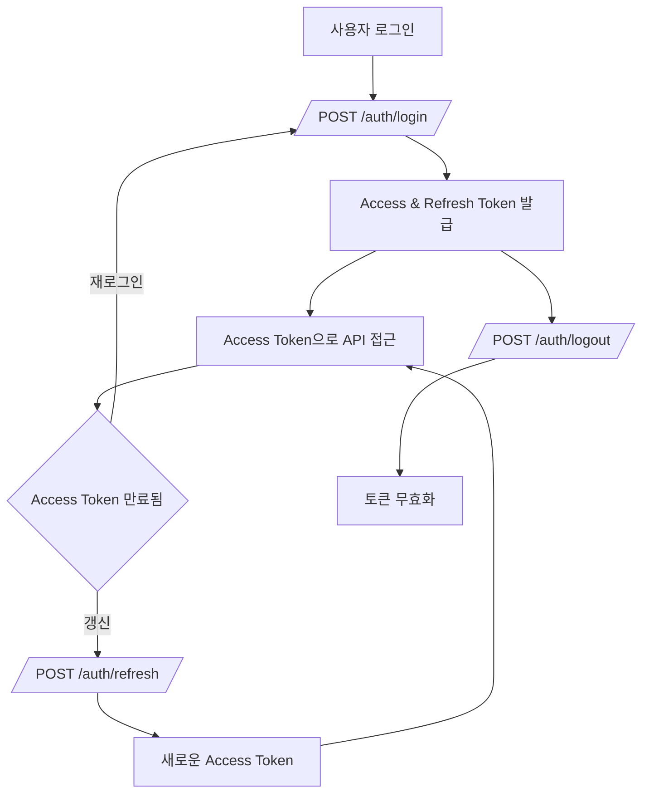
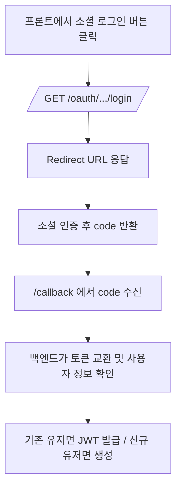
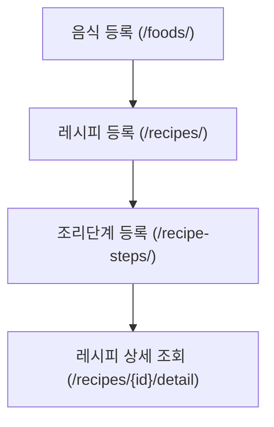
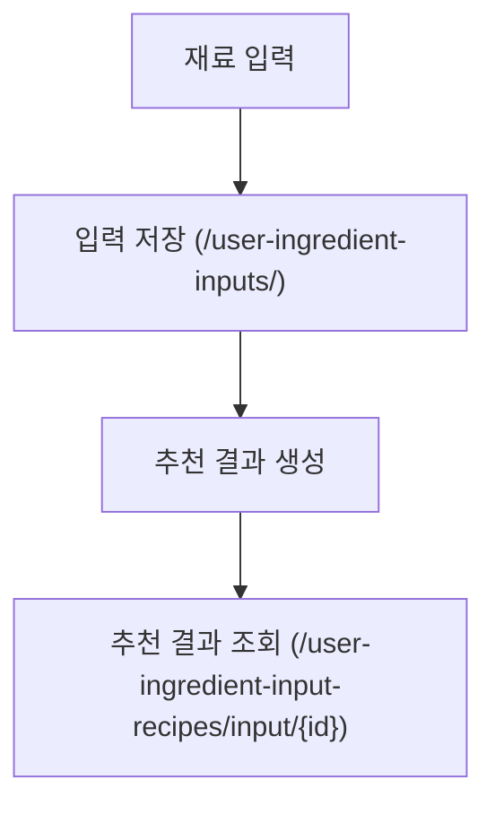
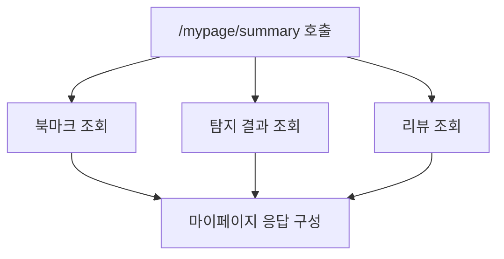

# API 명세서

# 📚 SnapnCook API Documentation

> ⏱️ Last updated: 2025-05-01 16:00:00
> 
> 
> 📎 Swagger UI: [`/docs`](http://localhost:8000/docs)
> 
> 📎 Redoc: [`/redoc`](http://localhost:8000/redoc) *(옵션)*
> 

이 문서는 SnapnCook의 백엔드에서 제공하는 FastAPI 기반의 REST API 엔드포인트를 정리한 것입니다.

Postman이나 Thunder Client 같은 도구를 통해 테스트하거나, 프론트엔드 연동 시 참고용으로 활용하세요.

---

## 📂 API 인덱스 (빠른 탐색)

- [📌 요약 정보](#요약-정보)
- [✅ 공통 요청 헤더](#공통-요청-헤더)
- [🔐 인증 흐름 개요](#인증-흐름-개요)
- [🌐 소셜 로그인 흐름](#소셜-로그인-흐름)
- [📌 향후 추가 예정 항목](#향후-추가-예정-항목)
- [📌 상태 코드별 에러 설명](#상태-코드별-에러-설명)
- [❗ 공통 오류 응답 형식](#공통-오류-응답-형식)
- [📊 주요 기능 흐름도 요약](#주요-기능-흐름도-요약)
- [✅ 전체 API 요청/응답 예시 (총 51개)](#전체-api-요청응답-예시-총-51개)

---

## 📌 요약 정보

| 분류 | 설명 |
| --- | --- |
| 인증 방식 | OAuth2 + JWT (Bearer Token) |
| 요청/응답 포맷 | application/json |
| Swagger 문서 | [`/docs`](http://localhost:8000/docs) |
| 테스트 도구 추천 | Postman, Thunder Client 등 |
| Swagger 기반 자동화 | ✅ summary/description 적용 완료 |

---

## ✅ 공통 요청 헤더

```
Content-Type: application/json
Authorization: Bearer <access_token>
```

---

## 🔐 인증 흐름 개요

1. /auth/login → Access + Refresh Token 발급
2. Access Token → API 인증에 사용
3. /auth/refresh → 새 Access Token 재발급
4. /auth/logout → Refresh Token 무효화 처리

---

## 🌐 소셜 로그인 흐름

1. /oauth/*/login → 소셜 로그인 시작
2. 리디렉션 URL로 이동 → 인증 후 code 전달
3. code → access token 발급 → 내부 유저 JWT 발급

---

## 📌 향후 추가 예정 항목

- Swagger 문서 외부 공개용 링크
- 자동 응답 모델 생성 연결
- axios 등 코드 예시 추가

---

## 📌 상태 코드별 에러 설명

| 코드 | 의미 | 설명 |
| --- | --- | --- |
| 200 | OK | 정상 처리됨 |
| 201 | Created | 리소스 생성됨 |
| 400 | Bad Request | 잘못된 요청 |
| 401 | Unauthorized | 인증 실패 |
| 403 | Forbidden | 권한 없음 |
| 404 | Not Found | 리소스 없음 |
| 422 | Validation Error | 유효성 실패 |
| 500 | Internal Server Error | 서버 오류 |

---

## ❗ 공통 오류 응답 형식

```json
{ "detail": "Not authenticated" }
```

기타 예시:

```json
{ "detail": "Invalid credentials" }
```

```json
{ "detail": "Item not found" }
```

---

## 📊 주요 기능 흐름도 요약

### 🔐 인증 흐름 (순차 흐름도)



### ☁️ 소셜 로그인 흐름 (OAuth)



### 📖 레시피 생성 및 제공 (관계 흐름)



### 🧑‍🍳 재료 입력 기반 추천 (시퀀스 흐름도)



### 📄 마이페이지 요약 흐름 (병렬 조회 구성)



---

## ✅ 전체 API 요청/응답 예시

### POST /auth/signup

> 📌 회원가입 - 이메일, 비밀번호, 닉네임을 입력 받아 새로운 계정을 생성합니다.
> 

**Request**

```json
{  "email": "user@example.com",  "password": "Password123!",  "nickname": "테스트유저"}
```

**Response**

```json
{  "id": 1,  "email": "user@example.com",  "nickname": "테스트유저",  "created_at": "2025-04-30T10:00:00"}
```

---

### POST /auth/login

> 📌 로그인 - 이메일과 비밀번호로 인증을 수행하고, Access Token을 발급받습니다.
> 

**Request**

```json
{  "email": "user@example.com",  "password": "Password123!"}
```

**Response**

```json
{  "access_token": "eyJhbGciOiJIUzI1NiIs...",  "token_type": "bearer"}
```

---

### GET /auth/me

> 📌 내 정보 조회 - 로그인된 사용자의 정보를 반환합니다.
> 

**Response**

```json
{  "id": 1,  "email": "user@example.com",  "nickname": "테스트유저",  "oauth_provider": null,  "profile_image_url": null,  "created_at": "2025-04-30T10:00:00"}
```

---

### POST /foods/

> 📌 음식 등록 - 새로운 음식 정보를 데이터베이스에 등록합니다.
> 

**Request**

```json
{  "name": "김치찌개",  "description": "맵고 시원한 김치찌개",  "image_url": "https://cdn.example.com/kimchi.jpg"}
```

**Response**

```json
{  "id": 1,  "name": "김치찌개",  "description": "맵고 시원한 김치찌개",  "image_url": "https://cdn.example.com/kimchi.jpg"}
```

---

### GET /recipes/1/detail

> 📌 레시피 상세 조회 - 음식 정보, 레시피 본문, 조리 단계까지 한 번에 조회합니다.
> 

**Response**

```json
{  
	"food": 
		{    
			"id": 1,    
			"name": "김치찌개",    
			"description": "맵고 시원한 김치찌개",    
			"image_url": "https://cdn.example.com/kimchi.jpg"  
		},  
	"recipe": 
		{    
			"id": 3,    
			"title": "김치찌개 만들기",    
			"ingredients": "김치, 돼지고기, 대파, 마늘",    
			"instructions": "1. 김치 썰기\n2. 고기 볶기\n3. 물 붓고 끓이기"  
		},  
	"steps": [    
		{      
			"step_order": 1,      
			"description": "김치를 썰어 준비합니다.",      
			"image_url": "https://cdn.example.com/step1.jpg"    
		},    
		{      
			"step_order": 2,      
			"description": "돼지고기를 볶습니다.",      
			"image_url": null    
		}  
	]
}
```

---

### POST /detection-results/

> 📌 음식 탐지 결과 저장 - AI 모델이 감지한 음식 결과를 저장합니다.
> 

**Request**

```json
{  "food_id": 1,  "image_path": "uploads/detect1.jpg",  "confidence": 0.88}
```

**Response**

```json
{  "id": 21,  "user_id": 1,  "food_id": 1,  "image_path": "uploads/detect1.jpg",  "confidence": 0.88,  "created_at": "2025-04-30T13:00:00"}
```

---

### GET /mypage/summary

> 📌 마이페이지 요약 - 북마크, 탐지결과, 리뷰를 한 번에 조회합니다.
> 

**Response**

```json
{  
	"bookmarks": [    
		{      
			"id": 1,      
			"recipe_id": 10,      
			"recipe_title": "김치찌개 레시피",      
			"recipe_thumbnail": "https://cdn.example.com/kimchi.jpg"    
		}  
	],  
	"detection_results": [    
		{      
			"id": 3,      
			"food_name": "비빔밥",      
			"image_path": "uploads/user1/1234.jpg",      
			"confidence": 0.95    
		}  
	],  
	"reviews": [    
		{      
			"id": 4,      
			"food_name": "된장찌개",      
			"content": "맛있어요!",      
			"rating": 5,      
			"food_image_url": "https://cdn.example.com/soybean.jpg"    
		}  
	]
}
```

---

### POST /users/

> 📌 유저 생성 - 새로운 사용자 계정을 등록합니다.
> 

**Request**

```json
{  "email": "user@example.com",  "password": "Password123!",  "nickname": "뉴유저"}
```

**Response**

```json
{  "id": 2,  "email": "user@example.com",  "nickname": "뉴유저",  "created_at": "2025-04-30T10:12:00"}
```

---

### GET /users/{user_id}

> 📌 유저 정보 조회 - 특정 user_id에 해당하는 사용자 정보를 반환합니다.
> 

**Response**

```json
{  "id": 2,  "email": "user@example.com",  "nickname": "뉴유저"}
```

---

### GET /users/

> 📌 전체 유저 목록 조회 - 시스템에 등록된 모든 유저 정보를 반환합니다.
> 

**Response**

```json
[  { "id": 1, "email": "admin@example.com" },  { "id": 2, "email": "user@example.com" }]
```

---

### POST /reviews/

> 📌 리뷰 작성 - 특정 음식에 대한 리뷰를 등록합니다.
> 

**Request**

```json
{  "food_id": 1,  "content": "국물이 진하고 맛있어요.",  "rating": 5}
```

**Response**

```json
{  "id": 31,  "user_id": 2,  "food_id": 1,  "content": "국물이 진하고 맛있어요.",  "rating": 5}
```

---

### GET /reviews/food/{food_id}

> 📌 음식별 리뷰 조회 - 특정 음식에 대한 모든 리뷰를 조회합니다.
> 

**Response**

```json
[  {    "id": 31,    "content": "국물이 진하고 맛있어요.",    "rating": 5,    "user_id": 2  }]
```

---

### GET /reviews/user/{user_id}

> 📌 유저별 리뷰 조회 - 특정 유저가 작성한 모든 리뷰를 조회합니다.
> 

**Response**

```json
[  {    "id": 31,    "food_id": 1,    "content": "국물이 진하고 맛있어요.",    "rating": 5  }]
```

---

### PATCH /reviews/{review_id}

> 📌 리뷰 수정 - 특정 리뷰 내용을 수정합니다.
> 

**Request**

```json
{  "content": "맛은 괜찮았어요.",  "rating": 4}
```

**Response**

```json
{  "id": 31,  "content": "맛은 괜찮았어요.",  "rating": 4}
```

---

### DELETE /reviews/{review_id}

> 📌 리뷰 삭제 - 특정 리뷰를 삭제합니다.
> 

**Response:** `204 No Content`

---

### POST /bookmarks/

> 📌 북마크 추가 - 사용자가 특정 레시피를 북마크에 등록합니다.
> 

**Request**

```json
{  "recipe_id": 3}
```

**Response**

```json
{  "id": 101,  "user_id": 2,  "recipe_id": 3}
```

---

### GET /bookmarks/me

> 📌 내 북마크 조회 - 현재 로그인된 사용자의 북마크 목록을 반환합니다.
> 

**Response**

```json
[  {    "id": 101,    "recipe_id": 3,    "recipe_title": "김치찌개 만들기"  }]
```

---

### DELETE /bookmarks/{bookmark_id}

> 📌 북마크 삭제 - 지정한 북마크를 삭제합니다.
> 

**Response:** `204 No Content`

---

### POST /recipe-steps/

> 📌 조리 단계 추가 - 레시피에 대한 새로운 조리 단계를 등록합니다.
> 

**Request**

```json
{  "recipe_id": 3,  "step_order": 1,  "description": "김치를 썰어 준비합니다.",  "image_url": "https://cdn.example.com/step1.jpg"}
```

**Response**

```json
{  "id": 201,  "recipe_id": 3,  "step_order": 1,  "description": "김치를 썰어 준비합니다."}
```

---

### GET /recipe-steps/recipe/{recipe_id}

> 📌 조리 단계 조회 - 특정 레시피의 조리 단계 목록을 순서대로 반환합니다.
> 

**Response**

```json
[  {    "step_order": 1,    "description": "김치를 썰어 준비합니다.",    "image_url": "https://cdn.example.com/step1.jpg"  }]
```

---

### POST /user-ingredient-inputs/

> 📌 재료 입력 저장 - 사용자가 입력한 재료 텍스트를 저장합니다.
> 

**Request**

```json
{  "input_text": "김치, 돼지고기, 두부"}
```

**Response**

```json
{  "id": 10,  "user_id": 2,  "input_text": "김치, 돼지고기, 두부"}
```

---

### GET /user-ingredient-inputs/{input_id}

> 📌 재료 입력 조회 - 저장된 재료 입력 정보를 input_id 기준으로 조회합니다.
> 

**Response**

```json
{  "id": 10,  "user_id": 2,  "input_text": "김치, 돼지고기, 두부"}
```

---

### POST /user-ingredient-input-recipes/

> 📌 추천 결과 매핑 저장 - 입력된 재료와 추천 레시피 간의 매핑을 저장합니다.
> 

**Request**

```json
{  "input_id": 10,  "recipe_id": 3,  "rank": 1}
```

**Response**

```json
{  "id": 301,  "input_id": 10,  "recipe_id": 3,  "rank": 1}
```

---

### GET /user-ingredient-input-recipes/input/{input_id}

> 📌 추천 결과 조회 - 특정 재료 입력에 대해 추천된 레시피 목록을 반환합니다.
> 

**Response**

```json
[  {    "recipe_id": 3,    "rank": 1  }]
```

---

### POST /user-logs/

> 📌 유저 행동 로그 생성 - 유저가 수행한 특정 행동을 서버에 기록합니다.
> 

**Request**

```json
{  "action": "view_recipe",  "target_id": 3,  "target_type": "recipe",  "meta": {    "from": "recommendation"  }}
```

**Response**

```json
{  "id": 888,  "user_id": 2,  "action": "view_recipe",  "target_type": "recipe"}
```

---

### GET /user-logs/user/{user_id}

> 📌 유저 행동 로그 조회 - 특정 유저의 활동 기록을 모두 불러옵니다.
> 

**Response**

```json
[  {    "action": "view_recipe",    "target_id": 3,    "target_type": "recipe"  }]
```

---

### GET /recommend/recipes/by-detection/{detection_id}

> 📌 AI 탐지 결과 기반 추천 - 감지된 음식(detection_id)을 바탕으로 추천 레시피를 조회합니다.
> 

**Response**

```json
[  {    "recipe_id": 3,    "title": "김치찌개 추천"  }]
```

---

### GET /recommend/recipes/by-ingredient/{input_id}

> 📌 재료 입력 기반 추천 - 사용자가 입력한 재료(input_id)를 기반으로 추천 레시피를 조회합니다.
> 

**Response**

```json
[  {    "recipe_id": 3,    "title": "김치찌개 추천"  }]
```

---

### POST /auth/refresh

> 📌 Access Token 재발급 - Refresh Token을 사용하여 새로운 Access Token을 발급합니다.
> 

**Request**

```json
{  "refresh_token": "sample_refresh_token"}
```

**Response**

```json
{  "access_token": "new_access_token",  "token_type": "bearer"}
```

---

### POST /auth/logout

> 📌 로그아웃 - Refresh Token을 무효화하여 로그아웃 처리를 수행합니다.
> 

**Request**

```json
{  "refresh_token": "sample_refresh_token"}
```

**Response:** `204 No Content`

---

### GET /oauth/google/login

> 📌 Google 로그인 시작 - Google OAuth 인증 절차를 시작합니다.
> 

**Response**

```json
{  "redirect_url": "https://accounts.google.com/o/oauth2/auth?..."}
```

---

### GET /oauth/kakao/login

> 📌 Kakao 로그인 시작 - Kakao OAuth 인증 절차를 시작합니다.
> 

**Response**

```json
{  "redirect_url": "https://kauth.kakao.com/oauth/authorize?..."}
```

---

### GET /oauth/naver/login

> 📌 Naver 로그인 시작 - Naver OAuth 인증 절차를 시작합니다.
> 

**Response**

```json
{  "redirect_url": "https://nid.naver.com/oauth2.0/authorize?..."}
```

---

### GET /users/me/social

> 📌 소셜 계정 정보 조회 - 현재 로그인된 유저의 소셜 로그인 정보를 반환합니다.
> 

**Response**

```json
{  "oauth_provider": "google",  "oauth_id": "mock-oauth-id"}
```

---

### DELETE /users/me/social/{provider}

> 📌 소셜 계정 연결 해제 - 현재 로그인된 유저의 소셜 계정({provider}) 연결을 해제합니다.
> 

**Response:** `204 No Content`

---

### PATCH /users/me

> 📌 내 정보 수정 - 닉네임 또는 프로필 이미지를 수정합니다.
> 

**Request**

```json
{  "nickname": "바뀐닉네임",  "profile_image_url": "https://cdn.example.com/newimage.jpg"}
```

**Response**

```json
{  "id": 1,  "nickname": "바뀐닉네임",  "profile_image_url": "https://cdn.example.com/newimage.jpg"}
```

---

### DELETE /users/me

> 📌 회원 탈퇴 - 현재 로그인된 사용자의 계정을 삭제합니다.
> 

**Response:** `204 No Content`

---

### POST /users/me/password

> 📌 비밀번호 변경 - 현재 비밀번호를 확인한 뒤 새 비밀번호로 변경합니다.
> 

**Request**

```json
{  "current_password": "Password123!",  "new_password": "NewPass456!"}
```

**Response:** `200 OK`