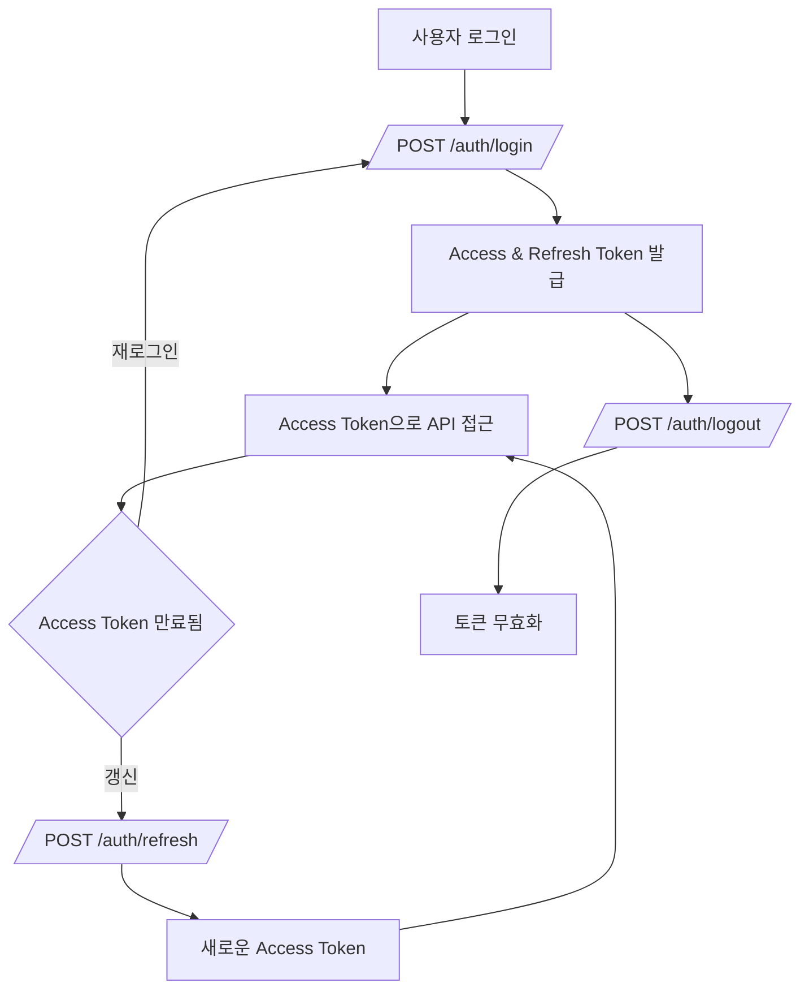
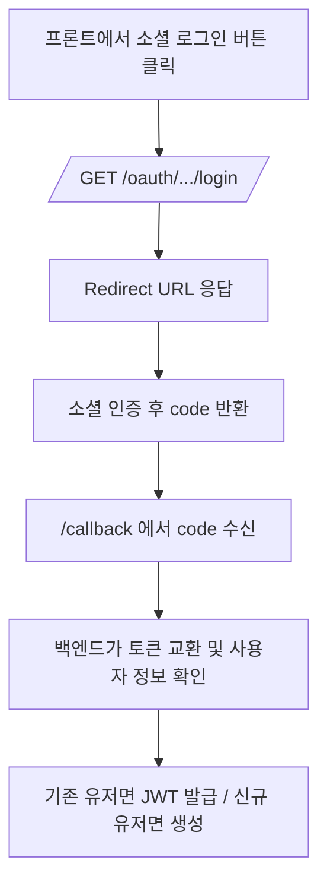
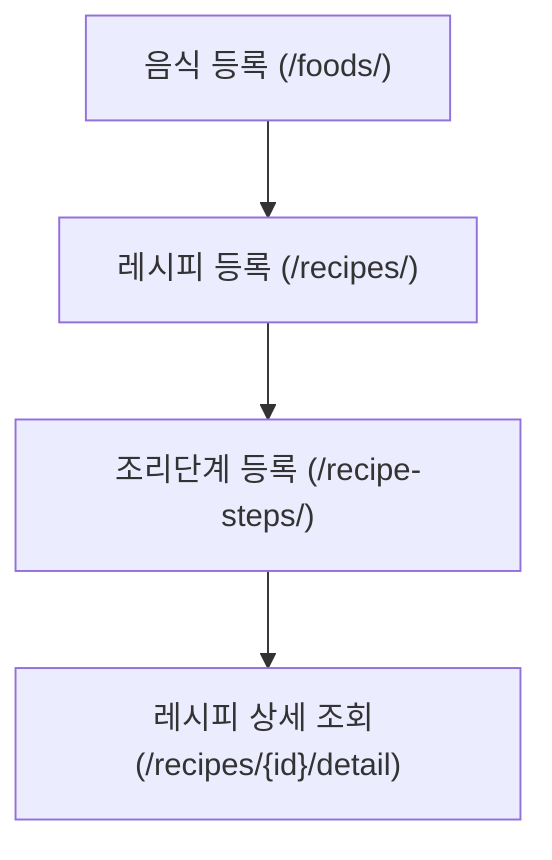
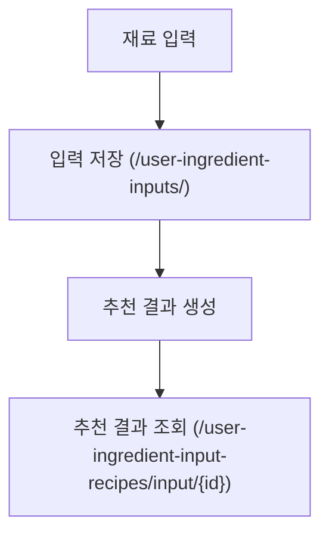
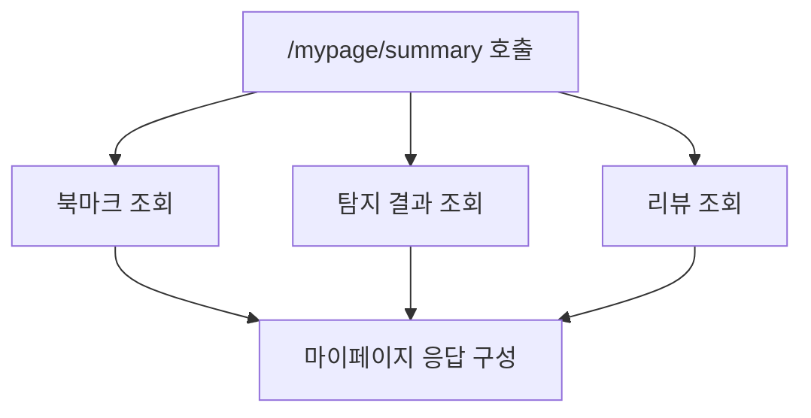

# API 명세서

# 📚 SnapnCook API Documentation

> ⏱️ Last updated: 2025-05-01 16:00:00
> 
> 
> 📎 Swagger UI: [`/docs`](http://localhost:8000/docs)
> 
> 📎 Redoc: [`/redoc`](http://localhost:8000/redoc) *(옵션)*
> 

이 문서는 SnapnCook의 백엔드에서 제공하는 FastAPI 기반의 REST API 엔드포인트를 정리한 것입니다.

Postman이나 Thunder Client 같은 도구를 통해 테스트하거나, 프론트엔드 연동 시 참고용으로 활용하세요.

---

## 📂 API 인덱스 (빠른 탐색)

- [📌 요약 정보](#요약-정보)
- [✅ 공통 요청 헤더](#공통-요청-헤더)
- [🔐 인증 흐름 개요](#인증-흐름-개요)
- [🌐 소셜 로그인 흐름](#소셜-로그인-흐름)
- [📌 향후 추가 예정 항목](#향후-추가-예정-항목)
- [📌 상태 코드별 에러 설명](#상태-코드별-에러-설명)
- [❗ 공통 오류 응답 형식](#공통-오류-응답-형식)
- [📊 주요 기능 흐름도 요약](#주요-기능-흐름도-요약)
- [✅ 전체 API 요청/응답 예시](#전체-api-요청응답-예시)

---

## 📌 요약 정보

| 분류 | 설명 |
| --- | --- |
| 인증 방식 | OAuth2 + JWT (Bearer Token) |
| 요청/응답 포맷 | application/json |
| Swagger 문서 | [`/docs`](http://localhost:8000/docs) |
| 테스트 도구 추천 | Postman, Thunder Client 등 |
| Swagger 기반 자동화 | ✅ summary/description 적용 완료 |

---

## ✅ 공통 요청 헤더

```
Content-Type: application/json
Authorization: Bearer <access_token>
```

---

## 🔐 인증 흐름 개요

1. /auth/login → Access + Refresh Token 발급
2. Access Token → API 인증에 사용
3. /auth/refresh → 새 Access Token 재발급
4. /auth/logout → Refresh Token 무효화 처리

---

## 🌐 소셜 로그인 흐름

1. /oauth/*/login → 소셜 로그인 시작
2. 리디렉션 URL로 이동 → 인증 후 code 전달
3. code → access token 발급 → 내부 유저 JWT 발급

---

## 📌 향후 추가 예정 항목

- Swagger 문서 외부 공개용 링크
- 자동 응답 모델 생성 연결
- axios 등 코드 예시 추가

---

## 📌 상태 코드별 에러 설명

| 코드 | 의미 | 설명 |
| --- | --- | --- |
| 200 | OK | 정상 처리됨 |
| 201 | Created | 리소스 생성됨 |
| 400 | Bad Request | 잘못된 요청 |
| 401 | Unauthorized | 인증 실패 |
| 403 | Forbidden | 권한 없음 |
| 404 | Not Found | 리소스 없음 |
| 422 | Validation Error | 유효성 실패 |
| 500 | Internal Server Error | 서버 오류 |

---

## ❗ 공통 오류 응답 형식

```json
{ "detail": "Not authenticated" }
```

기타 예시:

```json
{ "detail": "Invalid credentials" }
```

```json
{ "detail": "Item not found" }
```

---

## 📊 주요 기능 흐름도 요약

### 🔐 인증 흐름 (순차 흐름도)



### ☁️ 소셜 로그인 흐름 (OAuth)



### 📖 레시피 생성 및 제공 (관계 흐름)



### 🧑‍🍳 재료 입력 기반 추천 (시퀀스 흐름도)



### 📄 마이페이지 요약 흐름 (병렬 조회 구성)



---

## ✅ 전체 API 요청/응답 예시

## **auth_routes.py**

### POST /auth/signup

> 📌 회원가입 - 이메일, 비밀번호, 닉네임을 입력 받아 새로운 계정을 생성합니다.
> 

**Request**

```json
{
  "email": "user@example.com",
  "password": "Password123!",
  "password_check": "Password123!",
  "nickname": "테스트유저",
  "profile_image_url": null
}
```

**Response**

```json
{
  "id": 1,
  "email": "user@example.com",
  "nickname": "테스트유저",
  "profile_image_url": null,
  "oauth_provider": null,
  "oauth_id": null,
  "created_at": "2025-04-30T10:00:00",
  "updated_at": "2025-04-30T10:00:00",
  "social_accounts": []
}
```

---

### POST /auth/login

> 📌 로그인 - 이메일과 비밀번호로 인증을 수행하고, Access Token을 발급받습니다.
> 

**Request**

```json
{  
	"email": "user@example.com",  
	"password": "Password123!"
}
```

**Response**

```json
{  
	"access_token": "eyJhbGciOiJIUzI1NiIs...",  
	"token_type": "bearer"
}
```

---

### POST /auth/refresh

> 📌 Access Token 재발급 - Refresh Token을 사용하여 새로운 Access Token을 발급합니다.
> 

**Request**

```json
{  
	"refresh_token": "sample_refresh_token"
}
```

**Response**

```json
{  
	"access_token": "new_access_token",  "token_type": "bearer"
}
```

---

### POST /auth/logout

> 📌 로그아웃 - Refresh Token을 무효화하여 로그아웃 처리를 수행합니다.
> 

**Request**

```json
{
  "refresh_token": "sample_refresh_token"
}
```

**Response:** 
```json
{
  "message": "Logged out successfully"
}
```

---

### GET /auth/me

> 📌 내 정보 조회 - 로그인된 사용자의 정보를 반환합니다.
> 

**Request**
 
- Body: 없음 ❌

**Response**

```json
{
  "id": 1,
  "email": "user@example.com",
  "nickname": "테스트유저",
  "profile_image_url": null,
  "oauth_provider": "google",
  "oauth_id": "123456789",
  "created_at": "2025-04-30T10:00:00",
  "updated_at": "2025-04-30T10:00:00",
  "social_accounts": [
    {
      "provider": "google",
      "oauth_id": "123456789"
    }
  ]
}
```

---

## **food.py**

### POST /foods/

> 📌 음식 등록 - 새로운 음식 정보를 데이터베이스에 등록합니다.
> 

**Request**

```json
{  
	"name": "김치찌개",  
	"description": "맵고 시원한 김치찌개",  
	"image_url": "https://cdn.example.com/kimchi.jpg"
}
```

**Response**

```json
{  
	"id": 1,  
	"name": "김치찌개",  
	"description": "맵고 시원한 김치찌개",  
	"image_url": "https://cdn.example.com/kimchi.jpg"
}
```

---

### GET /foods/

> 📌 모든 음식 조회 - 등록된 전체 음식 목록을 반환합니다.
> 

**Request**
 
- Body: 없음 ❌

**Response**

```json
[
  {
    "id": 1,
    "name": "김치찌개",
    "description": "맵고 시원한 김치찌개",
    "image_url": "https://cdn.example.com/kimchi.jpg",
    "created_at": "2025-05-01T15:00:00",
    "updated_at": "2025-05-01T15:00:00"
  },
  {
    "id": 2,
    "name": "된장찌개",
    "description": "구수한 된장찌개",
    "image_url": null,
    "created_at": "2025-05-01T15:01:00",
    "updated_at": "2025-05-01T15:01:00"
  }
]
```

---

### GET /foods/{food_id}

> 📌 음식 단건 조회 - 지정한 food_id에 해당하는 음식 정보를 조회합니다.
> 

**Request**
 
- Body: 없음 ❌

**Response**

```json
{
  "id": 1,
  "name": "김치찌개",
  "description": "맵고 시원한 김치찌개",
  "image_url": "https://cdn.example.com/kimchi.jpg",
  "created_at": "2025-05-01T15:00:00",
  "updated_at": "2025-05-01T15:00:00"
}
```

---

## **recipe.py**

### POST /recipes/

> 📌 레시피 생성 - 음식에 대한 레시피 정보를 생성합니다.
> 

**Request**

```json
{
  "food_id": 1,
  "source_type": "User",
  "title": "김치찌개 만들기",
  "ingredients": "김치, 돼지고기, 대파",
  "instructions": "김치를 볶고 고기를 넣고 끓입니다.",
  "source_detail": "직접 입력"
}
```

**Response**

```json
{
  "id": 5,
  "food_id": 1,
  "source_type": "User",
  "title": "김치찌개 만들기",
  "ingredients": "김치, 돼지고기, 대파",
  "instructions": "김치를 볶고 고기를 넣고 끓입니다.",
  "source_detail": "직접 입력",
  "created_at": "2025-05-01T12:00:00",
  "updated_at": "2025-05-01T12:00:00"
}
```

---

### GET /recipes/

> 📌 모든 레시피 조회 - 등록된 모든 레시피 목록을 조회합니다.
> 

**Request**
 
- Body: 없음 ❌

**Response**

```json
[
  {
    "id": 5,
    "food_id": 1,
    "source_type": "User",
    "title": "김치찌개 만들기",
    "ingredients": "김치, 돼지고기, 대파",
    "instructions": "김치를 볶고 고기를 넣고 끓입니다.",
    "source_detail": "직접 입력",
    "created_at": "...",
    "updated_at": "..."
  }
]
```

---

### GET /recipes/{recipe_id}

> 📌 레시피 단건 조회 - 특정 레시피 ID로 레시피 정보를 조회합니다.
> 

**Request**
 
- Body: 없음 ❌

**Response**

```json
{
  "id": 5,
  "food_id": 1,
  "source_type": "User",
  "title": "김치찌개 만들기",
  "ingredients": "김치, 돼지고기, 대파",
  "instructions": "김치를 볶고 고기를 넣고 끓입니다.",
  "source_detail": "직접 입력",
  "created_at": "...",
  "updated_at": "..."
}
```

---

### GET /recipes/food/{food_id}

> 📌 특정 음식 ID로 레시피 리스트 조회 - 해당 음식에 대한 모든 레시피를 조회합니다.
> 

**Request**
 
- Body: 없음 ❌

**Response**

```json
[
  {
    "id": 5,
    "food_id": 1,
    "source_type": "User",
    "title": "김치찌개 만들기",
    "ingredients": "김치, 돼지고기, 대파",
    "instructions": "김치를 볶고 고기를 넣고 끓입니다.",
    "source_detail": "직접 입력",
    "created_at": "...",
    "updated_at": "..."
  }
]
```

---

### GET /recipes/{recipe_id}/detail

> 📌 레시피 상세 조회 - 음식 정보, 레시피 본문, 조리 단계까지 한 번에 조회합니다.
> 

**Request**
 
- Body: 없음 ❌

**Response**

```json
{  
	"food": 
		{    
			"id": 1,    
			"name": "김치찌개",    
			"description": "맵고 시원한 김치찌개",    
			"image_url": "https://cdn.example.com/kimchi.jpg"  
		},  
	"recipe": 
		{    
			"id": 3,    
			"title": "김치찌개 만들기",    
			"ingredients": "김치, 돼지고기, 대파, 마늘",    
			"instructions": "1. 김치 썰기\n2. 고기 볶기\n3. 물 붓고 끓이기"  
		},  
	"steps": [    
		{      
			"step_order": 1,      
			"description": "김치를 썰어 준비합니다.",      
			"image_url": "https://cdn.example.com/step1.jpg"    
		},    
		{      
			"step_order": 2,      
			"description": "돼지고기를 볶습니다.",      
			"image_url": null    
		}  
	]
}
```

---

## **recipestep.py**

### POST /recipe-steps/

> 📌 조리 단계 추가 - 레시피에 대한 새로운 조리 단계를 등록합니다.
> 

**Request**

```json
{  
	"recipe_id": 3,  
	"step_order": 1,  
	"description": "김치를 썰어 준비합니다.",  
	"image_url": "https://cdn.example.com/step1.jpg"
}
```

**Response**

```json
{  
	"id": 201,  
	"recipe_id": 3,  
	"step_order": 1,  
	"description": "김치를 썰어 준비합니다."
}
```

---

### GET /recipe-steps/recipe/{recipe_id}

> 📌 레시피별 조리 단계 조회 - 특정 레시피 ID에 해당하는 조리 단계를 순서대로 반환합니다.
> 

**Request**
 
- Body: 없음 ❌

**Response**

```json
[
  {
    "id": 101,
    "recipe_id": 5,
    "step_order": 1,
    "description": "김치를 썰어 준비합니다.",
    "image_url": "https://cdn.example.com/step1.jpg"
  },
  {
    "id": 102,
    "recipe_id": 5,
    "step_order": 2,
    "description": "돼지고기를 볶습니다.",
    "image_url": null
  }
]
```

---

## **detectionresult.py**

### POST /detection-results/

> 📌 음식 탐지 결과 저장 - AI 모델이 감지한 음식 결과를 저장합니다.
> 

**Request**

```json
{
  "food_id": 1,
  "image_path": "uploads/detect1.jpg",
  "confidence": 0.88
}
```

**Response**

```json
{
  "id": 21,
  "food_id": 1,
  "image_path": "uploads/detect1.jpg",
  "confidence": 0.88,
  "created_at": "2025-05-01T14:00:00",
  "updated_at": "2025-05-01T14:00:00"
}
```

---

### GET /detection-results/me

> 📌 내 탐지 결과 조회 - 현재 로그인한 사용자의 음식 탐지 결과 목록을 반환합니다.
>

**Request**
 
- Body: 없음 ❌

**Response**

```json
[
  {
    "id": 21,
    "food_id": 1,
    "image_path": "uploads/detect1.jpg",
    "confidence": 0.88,
    "created_at": "2025-05-01T14:00:00",
    "updated_at": "2025-05-01T14:00:00"
  },
  {
    "id": 22,
    "food_id": 2,
    "image_path": "uploads/detect2.jpg",
    "confidence": 0.91,
    "created_at": "2025-05-01T15:00:00",
    "updated_at": "2025-05-01T15:00:00"
  }
]
```

---

## **mypage.py**

### GET /mypage/summary

> 📌 마이페이지 요약 - 북마크, 탐지결과, 리뷰를 한 번에 조회합니다.(탐지결과는 5개까지 - 요청하면 제약 없애거나 숫자 변경 가능)
> 

**Headers**
```http
	Authorization: Bearer <access_token>
```

**Request**
 
- Body: 없음 ❌

**Response**

```json
{
  "bookmarks": [
    {
      "id": 1,
      "recipe_id": 10,
      "recipe_title": "김치찌개 만들기",
      "recipe_thumbnail": "https://cdn.example.com/kimchi.jpg"
    }
  ],
  "detection_results": [
    {
      "id": 3,
      "food_name": "비빔밥",
      "image_path": "uploads/user1/1234.jpg",
      "confidence": 0.95
    }
  ],
  "reviews": [
    {
      "id": 4,
      "food_name": "된장찌개",
      "content": "맛있어요!",
      "rating": 5,
      "food_image_url": "https://cdn.example.com/soybean.jpg"
    }
  ]
}
```

---

## **user.py**

### POST /users/

> 📌 회원가입 - 새로운 사용자를 생성합니다. 일반 이메일/비밀번호 방식입니다.
> 

**Request**

```json
{
  "email": "user@example.com",
  "password": "Password123!",
  "password_check": "Password123!",
  "nickname": "요리하는곰돌이",
  "profile_image_url": null
}
```

**Response**

```json
{
  "id": 1,
  "email": "user@example.com",
  "nickname": "요리하는곰돌이",
  "profile_image_url": null,
  "oauth_provider": null,
  "oauth_id": null,
  "created_at": "2025-05-01T10:00:00",
  "updated_at": "2025-05-01T10:00:00",
  "social_accounts": []
}
```

---

### GET /users/me

> 📌 내 정보 조회 - 로그인한 사용자의 정보를 반환합니다.
> 

**Request**
 
- Body: 없음 ❌

**Headers**

```http
Authorization: Bearer <access_token>
```

**Response**

```json
{
  "id": 1,
  "email": "user@example.com",
  "nickname": "요리하는곰돌이",
  "profile_image_url": null,
  "oauth_provider": null,
  "oauth_id": null,
  "created_at": "2025-05-01T10:00:00",
  "updated_at": "2025-05-01T10:00:00",
  "social_accounts": []
}
```

---

### GET /users/me/social

> 📌 소셜 연동 상태 확인 - 로그인한 유저가 어떤 소셜 계정으로 연동되어 있는지 확인합니다.
> 

**Request**
 
- Body: 없음 ❌

**Headers**

```http
Authorization: Bearer <access_token>
```

**Response**

```json
{
  "oauth_provider": "kakao",
  "oauth_id": "KAKAO_12345678"
}
```

---

### DELETE /users/me/social/{provider}

> 📌 소셜 연동 해제 - 해당 소셜 로그인 연동을 해제합니다.
> 

**Request**
 
- Body: 없음 ❌

**Headers**

```http
Authorization: Bearer <access_token>
```

**Response**

```json
{
  "message": "kakao 연동이 해제되었습니다."
}
```

---

### PATCH /users/me

> 📌 프로필 수정 - 닉네임 또는 프로필 이미지를 수정합니다.
> 

**Request**

```json
{
  "nickname": "쿠킹왕",
  "profile_image_url": "https://cdn.example.com/avatar.jpg"
}
```

**Headers**

```http
Authorization: Bearer <access_token>
```

**Response**

```json
{
  "id": 1,
  "email": "user@example.com",
  "nickname": "쿠킹왕",
  "profile_image_url": "https://cdn.example.com/avatar.jpg",
  "oauth_provider": null,
  "oauth_id": null,
  "created_at": "2025-05-01T10:00:00",
  "updated_at": "2025-05-02T10:00:00",
  "social_accounts": []
}
```

---

### DELETE /users/me

> 📌 회원 탈퇴 - 로그인된 사용자의 계정을 삭제합니다. Refresh Token도 함께 삭제됩니다.
> 

**Request**
 
- Body: 없음 ❌

**Headers**

```http
Authorization: Bearer <access_token>
```

**Response:** `204 No Content`

---

### PATCH /users/me/password

> 📌 비밀번호 변경 - 현재 비밀번호를 확인한 뒤 새 비밀번호로 변경합니다.
> 

**Request**

```json
{
  "current_password": "OldPassword123!",
  "new_password": "NewSecurePassword456!",
  "new_password_check": "NewSecurePassword456!"
}
```

**Headers**

```http
Authorization: Bearer <access_token>
```

**Response** 

```json
{
  "message": "비밀번호가 성공적으로 변경되었습니다."
}
```

---

## **userlog.py**

### POST /user-logs/

> 📌 사용자 로그 저장 - 현재 로그인한 사용자의 행동 로그를 기록합니다.
> 

**Request**

```json
{
  "action": "RECIPE_VIEW",
  "target_id": 5,
  "target_type": "recipe",
  "meta": {
    "from": "recommendation"
  }
}
```

**Headers**

```http
Authorization: Bearer <access_token>
```

**Response**

```json
{
  "id": 101,
  "user_id": 1,
  "action": "RECIPE_VIEW",
  "target_id": 5,
  "target_type": "recipe",
  "meta": {
    "from": "recommendation"
  },
  "created_at": "2025-05-01T18:40:00"
}
```

---

### GET /user-logs/me

> 📌 내 행동 로그 조회 - 로그인한 사용자의 전체 로그를 반환합니다.
> 

**Request**
 
- Body: 없음 ❌

**Headers**

```http
Authorization: Bearer <access_token>
```

**Response**

```json
[
  {
    "id": 101,
    "user_id": 1,
    "action": "RECIPE_VIEW",
    "target_id": 5,
    "target_type": "recipe",
    "meta": {
      "from": "recommendation"
    },
    "created_at": "2025-05-01T18:40:00"
  }
]
```

---

## **review.py**

### POST /reviews/

> 📌 리뷰 작성 - 특정 음식에 대한 리뷰를 등록합니다.
> 

**Request**

```json
{
  "food_id": 1,
  "content": "국물이 진하고 맛있어요.",
  "rating": 5
}
```

**Headers**

```http
	Authorization: Bearer <access_token>
```

**Response**

```json
{
  "id": 21,
  "food_id": 1,
  "content": "국물이 진하고 맛있어요.",
  "rating": 5,
  "created_at": "2025-05-01T16:00:00",
  "updated_at": "2025-05-01T16:00:00"
}
```

---

### GET /reviews/food/{food_id}

> 📌 음식별 리뷰 조회 - 특정 음식에 대한 모든 리뷰를 조회합니다.
> 

**Request**

- Body: 없음 ❌

**Response**

```json
[
  {
    "id": 21,
    "food_id": 1,
    "content": "국물이 진하고 맛있어요.",
    "rating": 5,
    "created_at": "...",
    "updated_at": "..."
  }
]
```

---

### GET /reviews/me

> 📌 내가 작성한 리뷰 조회 - 로그인된 사용자의 리뷰 전체 목록을 반환합니다.
> 

**Request**

- Body: 없음 ❌

**Headers**

```http
	Authorization: Bearer <access_token>
```

**Response**

```json
[
  {
    "id": 21,
    "food_id": 1,
    "content": "국물이 진하고 맛있어요.",
    "rating": 5,
    "created_at": "...",
    "updated_at": "..."
  }
]
```

---

### PATCH /reviews/{review_id}

> 📌 리뷰 수정 - 본인이 작성한 리뷰를 수정합니다.
> 

**Request**

```json
{
  "content": "맛은 괜찮았어요.",
  "rating": 4
}
```

**Headers**

```http
	Authorization: Bearer <access_token>
```

**Response**

```json
{
  "id": 21,
  "food_id": 1,
  "content": "맛은 괜찮았어요.",
  "rating": 4,
  "created_at": "...",
  "updated_at": "2025-05-01T17:00:00"
}
```
- ⛔️ 본인이 작성한 리뷰가 아닐 경우 403 Permission denied 반환

---

### DELETE /reviews/{review_id}

> 📌 리뷰 삭제 - 본인의 리뷰를 삭제합니다.
> 

**Request**

- Body: 없음 ❌

**Headers**

```http
	Authorization: Bearer <access_token>
```

**Response:** `204 No Content`

---

## **bookmarks.py**

### POST /bookmarks/

> 📌 북마크 추가 - 사용자가 특정 레시피를 북마크에 등록합니다.
> 

**Request**

```json
{  
	"recipe_id": 3
}
```

**Response**

```json
{
  "id": 101,
  "recipe_id": 3,
  "created_at": "2025-05-01T12:00:00"
}
```

---

### GET /bookmarks/me

> 📌 내 북마크 조회 - 현재 로그인된 사용자의 북마크 목록을 반환합니다.
> 

**Request**

- Body: 없음 ❌

**Response**

```json
[
  {
    "id": 101,
    "recipe_id": 3,
    "created_at": "2025-05-01T12:00:00"
  }
]
```

---

### DELETE /bookmarks/{bookmark_id}

> 📌 북마크 삭제 - 지정한 북마크를 삭제합니다.
> 

**Request**

- Body: 없음 ❌

**Response:** `204 No Content`

---

## **useringredientinput.py**

### POST /user-ingredient-inputs/

> 📌 재료 입력 저장 - 로그인한 사용자가 재료 텍스트를 입력하여 저장합니다.
> 

**Request**

```json
{
  "input_text": "김치, 돼지고기, 두부"
}
```

**Headers**

```http
Authorization: Bearer <access_token>
```

**Response**

```json
{
  "id": 11,
  "user_id": 1,
  "input_text": "김치, 돼지고기, 두부",
  "matched_food_ids": [1, 2],
  "created_at": "2025-05-01T18:00:00",
  "updated_at": "2025-05-01T18:00:00"
}
```

---

### GET /user-ingredient-inputs/{input_id}

> 📌 재료 입력 조회 - 로그인한 사용자가 저장한 재료 입력 기록을 조회합니다.
> 

**Request**

- Body: 없음 ❌

**Headers**

```http
Authorization: Bearer <access_token>
```

**Response**

```json
{
  "id": 11,
  "user_id": 1,
  "input_text": "김치, 돼지고기, 두부",
  "matched_food_ids": [1, 2],
  "created_at": "2025-05-01T18:00:00",
  "updated_at": "2025-05-01T18:00:00"
}
```

---

## **useringredientinputrecipe.py**

### POST /user-ingredient-input-recipes/

> 📌 추천 결과 매핑 저장 - 입력된 재료와 추천 레시피 간의 매핑을 저장합니다.
> 

**Request**

```json
{
  "input_id": 11,
  "recipe_id": 5,
  "rank": 1
}
```

**Headers**

```http
Authorization: Bearer <access_token>
```

**Response**

```json
{
  "id": 101,
  "input_id": 11,
  "recipe_id": 5,
  "rank": 1
}
```

---

### GET /user-ingredient-input-recipes/input/{input_id}

> 📌 입력 ID 기준 추천 레시피 조회 - 해당 재료 입력에 대해 추천된 레시피들을 순위 순으로 반환합니다.
> 

**Request**

- Body: 없음 ❌

**Headers**

```http
Authorization: Bearer <access_token>
```

**Response**

```json
[
  {
    "id": 101,
    "input_id": 11,
    "recipe_id": 5,
    "rank": 1
  },
  {
    "id": 102,
    "input_id": 11,
    "recipe_id": 12,
    "rank": 2
  }
]
```

---

## **recommend.py**

### GET /recommend/public/by-detection/{detection_id}

> 📌 공개 - 탐지 결과 기반 추천
> 로그인하지 않아도 AI 탐지 결과 ID를 기반으로 레시피를 추천받습니다. 
> 

**Request**

- Body: 없음 ❌

**Response**

```json
[
  {
    "id": 10,
    "food_id": 1,
    "source_type": "User",
    "title": "김치찌개 레시피",
    "ingredients": "김치, 돼지고기, 대파",
    "instructions": "김치를 볶고 고기를 넣고 끓입니다.",
    "source_detail": "직접 입력",
    "created_at": "...",
    "updated_at": "..."
  }
]
```

---

### GET /recommend/public/by-ingredient/{input_id}

> 📌 공개 - 재료 입력 기반 추천
> 입력된 재료 기반으로 매칭된 음식들의 레시피를 추천합니다.
> 

**Request**

- Body: 없음 ❌

**Response**

```json
[
  {
    "id": 12,
    "food_id": 2,
    "source_type": "User",
    "title": "된장찌개",
    "ingredients": "된장, 두부, 감자",
    "instructions": "...",
    "source_detail": null,
    "created_at": "...",
    "updated_at": "..."
  }
]
```

---

### GET /recommend/private/by-detection/{detection_id}

> 📌 개인 - 탐지 결과 기반 추천
> 로그인된 사용자 본인의 탐지 결과 ID만 사용 가능하며, 다른 사용자의 ID 접근 시 404 반환.
> 

**Request**

- Body: 없음 ❌

**Headers**

```http
	Authorization: Bearer <access_token>
```

**Response**

```json
[
  {
    "id": 10,
    "food_id": 1,
    "source_type": "User",
    "title": "김치찌개 레시피",
    "ingredients": "김치, 돼지고기, 대파",
    "instructions": "김치를 볶고 고기를 넣고 끓입니다.",
    "source_detail": "직접 입력",
    "created_at": "...",
    "updated_at": "..."
  }
]
```

---

### GET /recommend/private/by-ingredient/{input_id}

> 📌 개인 - 재료 입력 기반 추천
> 사용자 본인이 입력한 재료 ID로만 추천 가능 (타인의 ID 사용 시 접근 거부됨).
> 

**Request**

- Body: 없음 ❌

**Headers**

```http
	Authorization: Bearer <access_token>
```

**Response**

```json
[
  {
    "id": 12,
    "food_id": 2,
    "source_type": "User",
    "title": "된장찌개",
    "ingredients": "된장, 두부, 감자",
    "instructions": "...",
    "source_detail": null,
    "created_at": "...",
    "updated_at": "..."
  }
]
```

---

## **oauth_routes.py**

### GET /oauth/google/login

> 📌 Google 로그인 시작 - Google OAuth 인증 절차를 시작합니다.
> 

**Request**
 
- Body: 없음 ❌

**Response**

```json
{  
	"redirect_url": "https://accounts.google.com/o/oauth2/auth?..."
}
```

---

### GET /oauth/google/callback

> 📌 Google OAuth 콜백 - 인증 완료 후 리디렉션된 사용자의 code를 처리하여 JWT 토큰을 발급합니다.
> 

**Request**
 
- Body: 없음 ❌
- Query Params: code, state (Google이 자동으로 붙여줌)

**Response**

```json
{
  "access_token": "eyJhbGciOiJIUzI1NiIsInR5cCI6...",
  "refresh_token": "def456...",
  "token_type": "bearer"
}
```

---

### GET /oauth/kakao/login

> 📌 Kakao 로그인 시작 - Kakao OAuth 인증 절차를 시작합니다.
> 

**Request**
 
- Body: 없음 ❌

**Response**

```json
{  
	"redirect_url": "https://kauth.kakao.com/oauth/authorize?..."
}
```

---

### GET /oauth/kakao/callback

> 📌 Kakao OAuth 콜백 - 카카오 인증 완료 후 전달된 code를 처리하여 사용자 계정을 생성하거나 로그인 처리합니다.
> 

**Request**
 
- Body: 없음 ❌
- Query Params: code

**Response**

```json
{
  "access_token": "eyJhbGciOiJIUzI1NiIsInR5cCI6...",
  "refresh_token": "ghi789...",
  "token_type": "bearer"
}
```

---

### GET /oauth/naver/login

> 📌 Naver 로그인 시작 - Naver OAuth 인증 절차를 시작합니다.
> 

**Request**
 
- Body: 없음 ❌

**Response**

```json
{  
	"redirect_url": "https://nid.naver.com/oauth2.0/authorize?..."
}
```

---

### GET /oauth/naver/callback

> 📌 Naver OAuth 콜백 - 네이버 인증 후 전달된 code를 처리하고 내부 사용자 인증 토큰을 발급합니다.
> 

**Request**
 
- Body: 없음 ❌
- Query Params: code, state

**Response**

```json
{
  "access_token": "eyJhbGciOiJIUzI1NiIsInR5cCI6...",
  "refresh_token": "abc123...",
  "token_type": "bearer"
}
```

---

## **home.py**

### GET /home/popular-searches

> 📌 인기 검색어 랭킹을 일간 또는 주간 기준으로 제공하며, 순위 변동 추세를 함께 반환합니다.
>

**Query Parameters**

| 이름 | 타입 | 설명 | 기본값 |
|------|------|------|--------|
| period | string | 집계 기준 (`day` 또는 `week`) | day |

**Request**

- Body: 없음 ❌

**Response**

```json
{
  "period": "day",
  "rankings": [
    {
      "rank": 1,
      "keyword": "김치찌개",
      "previous_rank": 3,
      "trend": "up"
    },
    {
      "rank": 2,
      "keyword": "비빔밥",
      "previous_rank": 1,
      "trend": "down"
    },
    {
      "rank": 3,
      "keyword": "삼겹살",
      "previous_rank": 2,
      "trend": "down"
    }
  ]
}
```

**Trend 값 설명**

| trend | 설명 | 표시 |
|-------|------|------|
| up | 순위 상승 | 🔼 (녹색 화살표) |
| down | 순위 하락 | 🔽 (빨간 화살표) |
| same | 순위 유지 | → (회색 화살표) |
| new | 신규 진입 | NEW (파란색 라벨) |

---

### GET /home/recommended-food

> 📌 오늘의 추천 메뉴 - 랜덤으로 한식 음식 중 하나를 선택해 이미지, 평점 등과 함께 반환합니다.
>

**Request**

- Body: 없음 ❌

**Response**

```json
{
  "date": "2025-05-03",
  "food": {
    "id": 123,
    "name": "삼겹살",
    "description": "바삭하고 육즙이 풍부한 돼지고기 구이",
    "image_url": "https://example.com/images/samgyeopsal.jpg",
    "rating": 4.8,
    "reason": "오늘의 추천 메뉴로 즐겨보세요!"
  }
}
```

---

## **admin.py**

> 모든 Admin API는 `Authorization: Bearer <access_token>` 헤더가 필요합니다.  
> 관리자 권한 (`is_admin=True`) 을 가진 계정만 접근 가능합니다.

---

### 👤 [유저 관리]

#### GET /admin/users

> 📌 모든 유저 목록 조회

**Request**

- 없음 ❌

**Response**

```json
[
  {
    "id": 1,
    "email": "admin@example.com",
    "nickname": "관리자",
    "is_admin": true
  }
]
```

#### PUT /admin/users/{user_id}

> 📌 유저 정보 수정

**Request**

```json
{
  "nickname": "변경된닉네임",
  "is_admin": true
}
```

**Response**

```json
{
  "id": 1,
  "nickname": "변경된닉네임",
  "is_admin": true
}
```

#### DELETE /admin/users/{user_id}

> 📌 유저 삭제

**Request**

- 없음 ❌

**Response**

- 204 No Content

---

### 🍽 [음식 관리]

#### GET /admin/foods

> 📌 모든 음식 목록 조회

**Request**

- 없음 ❌

**Response**

```json
[
  {
    "id": 1,
    "name": "된장찌개",
    "description": "한국 전통 찌개",
    "image_url": "https://example.com/img.jpg"
  }
]
```

#### PUT /admin/foods/{food_id}

> 📌 음식 정보 수정

**Request**

```json
{
  "name": "수정된 음식 이름",
  "description": "설명 수정",
  "image_url": "https://example.com/updated.jpg"
}
```

**Response**

```json
{
  "id": 1,
  "name": "수정된 음식 이름",
  "description": "설명 수정",
  "image_url": "https://example.com/updated.jpg"
}
```

#### DELETE /admin/foods/{food_id}

> 📌 음식 삭제

**Request**

- 없음 ❌

**Response**

- 204 No Content

---

### 📋 [레시피 관리]

#### GET /admin/recipes

> 📌 레시피 목록 조회 (필터: `title`, `food_id`, `source_type`)

**Request**

- 없음 ❌

**Response**

```json
[
  {
    "id": 1,
    "title": "김치찌개",
    "ingredients": "김치, 돼지고기",
    "instructions": "볶고 끓인다.",
    "food_id": 1,
    "source_type": "User"
  }
]
```

#### PUT /admin/recipes/{recipe_id}

> 📌 레시피 정보 수정

**Request**

```json
{
  "title": "수정된 레시피 이름",
  "ingredients": "재료 목록",
  "instructions": "조리법 수정"
}
```

**Response**

```json
{
  "id": 1,
  "title": "수정된 레시피 이름",
  "ingredients": "재료 목록",
  "instructions": "조리법 수정"
}
```

#### DELETE /admin/recipes/{recipe_id}

> 📌 레시피 삭제

**Request**

- 없음 ❌

**Response**

- 204 No Content

---

### 📝 [리뷰 관리]

#### GET /admin/reviews

> 📌 리뷰 목록 조회 (필터: `user_id`, `food_id`, `rating`, `keyword`)

**Request**

- 없음 ❌

**Response**

```json
[
  {
    "id": 1,
    "user_id": 2,
    "food_id": 3,
    "rating": 5,
    "content": "아주 맛있었어요!"
  }
]
```

#### DELETE /admin/reviews/{review_id}

> 📌 리뷰 삭제

**Request**

- 없음 ❌

**Response**

- 204 No Content

---

### 📊 [로그 관리]

#### GET /admin/logs

> 📌 유저 로그 조회 (필터: `user_id`, `action`, `target_type`, `limit`, `offset`)

**Request**

- 없음 ❌

**Response**

```json
[
  {
    "id": 1,
    "user_id": 2,
    "action": "review_create",
    "target_type": "review",
    "target_id": 7,
    "created_at": "2025-05-06T12:00:00Z"
  }
]
```
