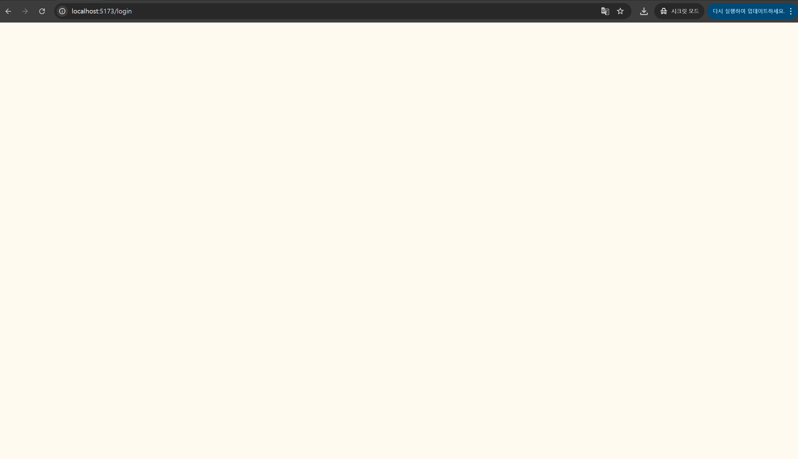
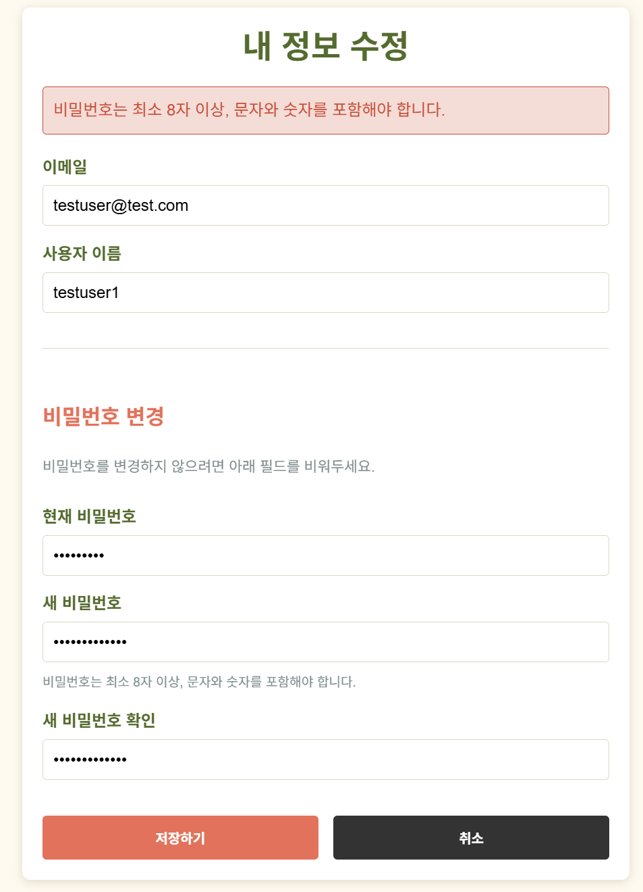
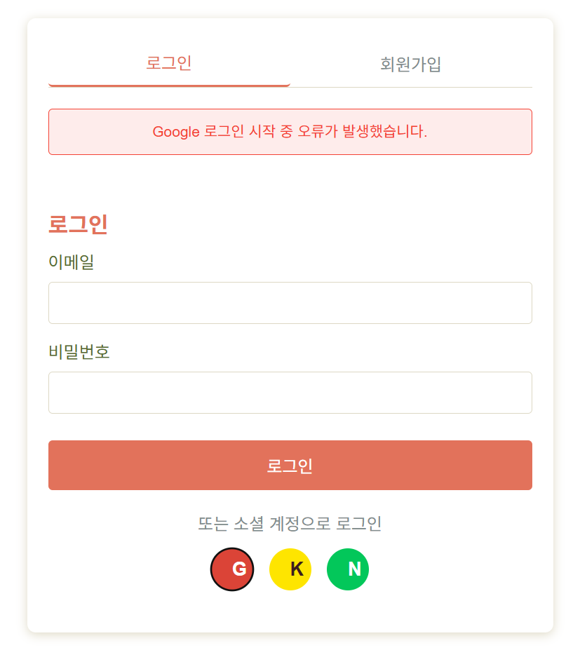

# ✅ SnapNCook 사용자 테스트 결과 기록

> **테스트 일자**: 2025-05-10  
> **테스트 환경**: dev 서버 (localhost:8000) + 실제 프론트 연결  
> **테스트 담당자**: 민지원 (백엔드)

---

## ✅ 결과 코드 표기 안내

| 코드 | 의미 |
|------|------|
| ✅ | 성공 (정상 동작) |
| ⚠️ | 경고 (동작은 되지만 개선 필요) |
| ❌ | 실패 (기능 오류 또는 예외 처리 안 됨) |

---

## 🔍 테스트 요약표

| 시나리오 번호 | 테스트 항목                           | 결과   | 비고 |
|---------------|--------------------------------------|--------|--------|
| 1-1           | 회원가입 실패 - 메시지 부족           |  ⚠️   | 실패 원인 안내 메시지가 부족함 |
| 1-2           | 이메일 중복                          |  ✅    | "Email already registered" 메시지 확인 |
| 1-3           | 비밀번호 조건 미달                    |  ⚠️    | 메시지는 나왔지만 UI에서 표시 안 됨 |
| 1-4           | 로그인 성공                          |  ✅    | 토큰 정상 발급됨 |
| 1-5           | 로그인 실패 - 비밀번호 오류            |  ✅   | "Incorrect password" 메시지 출력 |
| 1-6           | 로그인 실패 - 존재하지 않는 이메일     |  ✅    | "Invalid credentials" 메시지 확인 |
| 1-7           | 내 정보 조회                          |  ✅    | 토큰 인증 후 email, nickname 포함 |
| 1-8           | 비밀번호 변경 성공                     |  ❌    | 기능이 동작 안 함 |
| 1-9           | 비밀번호 변경 실패 - 현재 비밀번호 오류 |  ❌    | 기능이 동작 안 함 |
| 1-10          | 비밀번호 변경 실패 - 원인 불분명        |  ⚠️    | 기능이 동작 안 함 + 다양한 원인에 대해 동일 메시지 출력됨 |
| 1-11          | 로그아웃 성공                          |  ✅    | refresh token 무효화 확인 필요 |
| 1-12          | 토큰 재발급 성공                       |  ✅    | 새 access_token 반환됨 |
| 1-13          | 토큰 재발급 실패 - 만료/폐기됨          |  ✅    | "Invalid or expired refresh token" 메시지 확인 |
| 1-14          | 소셜 로그인 성공 (Google/Kakao/Naver)   |  ❌   | 302까진 응답되지만 인증 흐름 실패, 오류 메시지 출력됨 |
| 6-6           | 마이페이지 요약 조회                    |  ✅    | 북마크, 탐지 결과, 리뷰 정상 조회됨 |

> ⚠️ 표시 이외의 기능은 현재 프론트엔드 UI가 구현되지 않아 테스트 불가 상태입니다. 추후 구현 완료 시 재테스트 예정입니다.

---

## ⚠️ 변경 요구사항 및 개선 포인트

- 오류 문구를 한글로 변경 요망(사용자의 빠른 이해를 위해)

---

### 🔹 1-1. 회원가입 실패 - 메시지 부족

- **상황**: 이메일 중복, 비밀번호 조건 불충족 등 다양한 경우
- **기대 결과**:
  - `"이미 등록된 이메일입니다"`
  - `"비밀번호 확인이 일치하지 않습니다"`
- **실제 결과**: `"비밀번호는 최소 8자 이상, 문자와 숫자를 포함해야 합니다."`만 출력됨
- **상태**: ⚠️ 백엔드 메시지 다양화 + 프론트 분기 렌더링 필요

---

### 🔹 1-3. 회원가입 실패 - 비밀번호 조건 미달

- **1차 입력**:
```json
{
  "email": "testuser@test.com",
  "password": "testuser1!",
  "nickname": "testuser1"
}
```
- **실제 결과**: 400 `"비밀번호 조건에 맞지 않습니다."` (UI 미표시)

- **2차 입력**:
```json
{
  "email": "testuser2@test.com",
  "password": "testuser2",
  "nickname": "testuser2"
}
```
- **응답**: 400 / 422  
- **화면 전환**: `/login`으로 이동되었지만 내용 없음



- **상태**: ⚠️ UI 처리 미흡, 백엔드 로직은 정상

---

### 🔹 1-8. 비밀번호 변경 성공

- **요청**: `PATCH /users/me/password`
```json
{
  "current_password": "testuser1!",
  "new_password": "testuser1!new"
}
```
- **기대 결과**: 200, `"Password updated successfully"`
- **상태**: ❌ 실행자체가 안 됨


- 비밀번호를 맞게 입력해도 틀리게 입력해도 "비밀번호는 최소 8자 이상, 문자와 숫자를 포함해야 합니다."만 뜨고 아무것도 변하는 것이 없음

---

### 🔹 1-9. 비밀번호 변경 실패 - 현재 비밀번호 오류

- **입력**: 틀린 current_password
- **상태**: ❌ 실행 자체가 안 됨

---

### 🔹 1-10. 비밀번호 변경 실패 - 원인 불분명

- **상황**: 아래 조건 중 하나 이상 실패
  - 현재 비밀번호 틀림
  - 새 비밀번호 조건 미달
  - 새 비밀번호 확인 불일치
- **기대 결과**: 원인별 메시지 제공
- **실제 결과**: 위의 경우 처럼 실행 자체가 안 되서 확인 불가 다만 해당 사항 추가하면 좋을 거 같아서 입력
- **상태**: ❌ 백엔드 메시지 분기 + 프론트 렌더링 분리 필요

---

### 🔹 1-14. 소셜 로그인 실패 - OAuth 시작 실패 (Google/Kakao/Naver)

- **상황**: 로그인 페이지에서 Google/Kakao/Naver 아이콘 클릭
- **로그**: 백엔드에서는 `302 Found`로 redirect 동작 확인됨
- **문제**: 이후 redirect 흐름에서 오류 발생
- **화면**: `"Google/Kakao/Naver 로그인 시작 중 오류가 발생했습니다."` 메시지 표시됨

- **원인 추정**:
  - OAuth redirect URI mismatch
  - 프론트에서 redirect callback 처리 누락
  - CORS 또는 인증 설정 오류 가능성
- **상태**: ❌ 리디렉션 흐름 시작은 되었지만 사용자 인증 흐름 완료 실패

---

## 📝 개선 제안 요약

- 프론트엔드:
  - 비밀번호 오류 시 에러 메시지를 사용자에게 명확하게 노출해야 함
  - `/login`으로의 잘못된 이동 방지 필요
  - 소셜 로그인 실패 시 원인에 따라 적절한 안내 메시지 분기 필요
  - OAuth 인증 흐름 실패 시 fallback 페이지 또는 자동 복귀 처리 필요

- 백엔드:
  - 회원가입 / 비밀번호 변경 등 에러 메시지를 상황별로 세분화
  - 동일한 HTTP 상태 코드 내에서도 구체적인 오류 메시지 분기 처리
  - 소셜 로그인 리디렉션 실패 시 에러 로그 명확화 및 fallback 응답 고려
