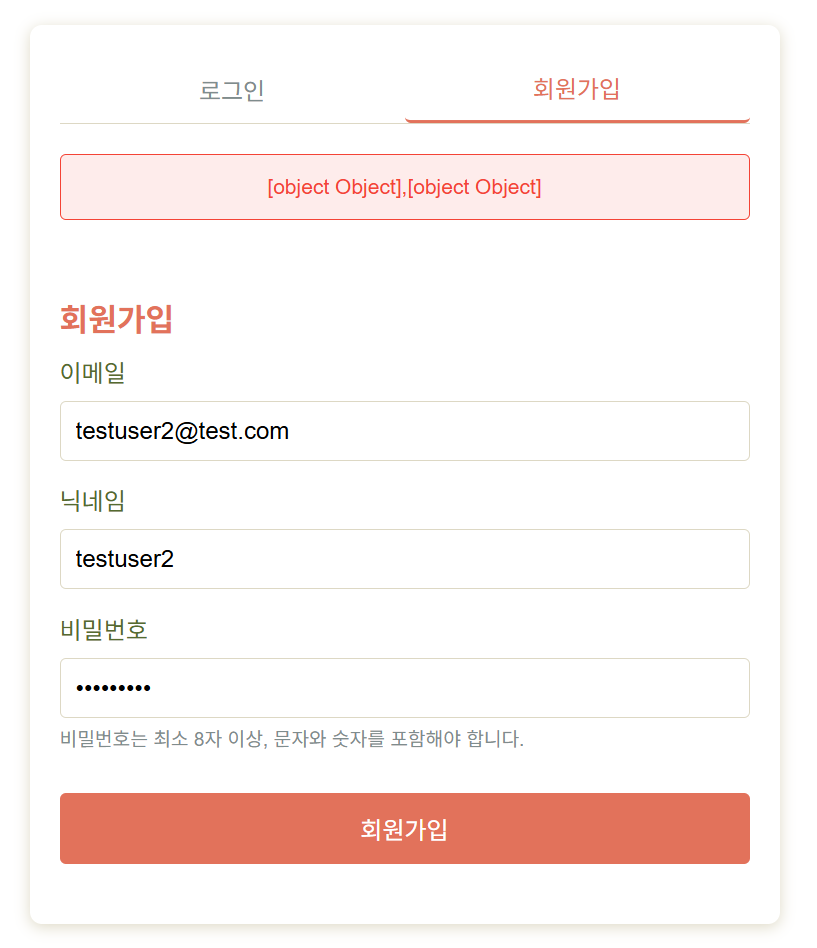
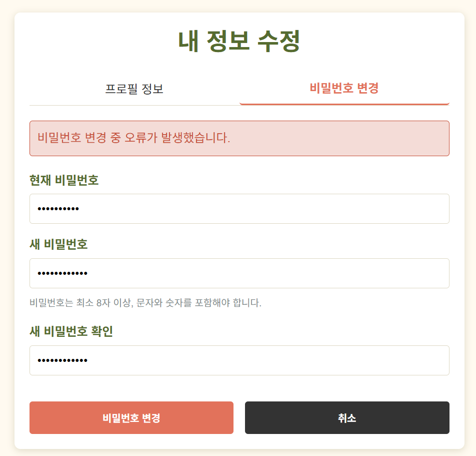

# ✅ SnapNCook 사용자 테스트 결과 기록 (2차)

> **테스트 일자**: 2025-05-11
> **테스트 환경**: dev 서버 (localhost:8000) + 실제 프론트 연결  
> **테스트 담당자**: 민지원 (백엔드)

---

## ✅ 결과 코드 표기 안내

| 코드 | 의미 |
|------|------|
| ✅ | 성공 (정상 동작) |
| ⚠️ | 경고 (동작은 되지만 개선 필요) |
| ❌ | 실패 (기능 오류 또는 예외 처리 안 됨) |

---

## 🔍 2차 테스트 요약표 (선별 항목)

| 시나리오 번호 | 테스트 항목                           | 결과   | 비고 |
|---------------|--------------------------------------|--------|--------|
| 1-1           | 회원가입 실패 - 메시지 부족           |   ❌   | `password_check` 필드가 누락된 상태로 요청됨 → 422 발생 / 프론트 에러 메시지 파싱 실패 (`[object Object]`) |
| 1-3           | 회원가입 실패 - 비밀번호 조건 미달     |   ❌   | 백엔드 유효성 검사 메시지는 정상이나, 프론트에서는 fallback 메시지나 잘못된 메시지 출력됨 |
| 1-8           | 비밀번호 변경 성공                    |   ❌   | 조건 충족했음에도 요청이 `POST`로 보내져서 백엔드에 도달하지 않음 / 프론트에서 고정 에러 메시지 출력 |
| 1-9           | 비밀번호 변경 실패 - 현재 비밀번호 오류 |   ❌   | 비밀번호 조건 충족 상태였지만 요청 미도달로 백엔드 로직 실행 안 됨 / 오류 메시지도 실제 원인과 무관 |
| 1-10          | 비밀번호 변경 실패 - 원인별 메시지     |   ❌   | 조건 미달 시만 서버 응답이 존재했으며, 나머지 케이스는 서버 미도달 / 모든 경우 fallback 메시지 출력 |

> ✅ 기존 실패했던 시나리오 위주로 2차 점검을 진행했습니다. 프론트 미적용 기능은 테스트 생략.

---

## 🔄 상세 시나리오 결과

### 🔹 1-1. 회원가입 실패 - 메시지 부족

- **요청 예시** (프론트에서 password_check 누락 상태):
```json
{
  "email": "testuser2@test.com",
  "password": "testuser2!",
  "nickname": "testuser2"
}
```

- **응답 상태 코드**: `422 Unprocessable Content`

- **화면 반응**: 아무런 메시지 출력 없이 요청 실패
- **원인 분석**:  
  백엔드에서 `password_check`를 필수로 요구하도록 변경되었으나,  
  프론트에서는 해당 필드 입력값 없이 요청을 보내 422 발생

- **결과**: ❌

- **개선 제안**:
  - 프론트에서 비밀번호 확인 입력 필드 추가
  - 백엔드와 동일하게 일치 여부 검증
  - 누락 시 "비밀번호 확인을 입력해주세요" 등 사용자 친화적 메시지 필요

---

### 🔹 1-3. 회원가입 실패 - 비밀번호 조건 미달 (프론트 메시지 처리 문제)

- **입력 예시**:
```json
{
  "email": "testuser2@test.com",
  "password": "testuser2",  // 조건 미달
  "password_check": "testuser", // 다만 이 부분은 아직 프론트로 전달 못한 사항이라 없는게 당연연
  "nickname": "testuser2"
}
```

- **응답 상태 코드**: 422 Unprocessable Content  
- **백엔드 응답 메시지**:
```json
{
  "detail": [
    {
      "loc": ["body", "password"],
      "msg": "비밀번호에는 최소 1개의 숫자가 포함되어야 합니다.",
      "type": "value_error"
    },
    {
      "loc": ["body", "password"],
      "msg": "비밀번호에는 최소 1개의 특수문자(@$!%*#?&)가 포함되어야 합니다.",
      "type": "value_error"
    }
  ]
}
```

- **프론트 화면 반응**:
  - `"[object Object],[object Object]"`라는 텍스트가 붉은 경고 박스로 출력됨
  - 사용자 입장에서 무슨 오류인지 알 수 없음
  

- **문제 원인**:
  - 백엔드에서 `detail` 배열 형태로 메시지를 반환했지만,
  - 프론트에서 `.msg`를 파싱하지 않고 객체 자체를 문자열 처리해 출력함

- **결과**: ⚠️ (백엔드는 정상, 프론트 메시지 처리 실패)

- **개선 제안**:
  - 프론트에서 `detail.map(e => e.msg).join('\n')` 방식으로 메시지를 추출하여 출력해야 함
  - 개별 input 아래에 메시지를 분리하여 표시하는 UI 개선도 추천

---

### 🔹 1-8. 비밀번호 변경 성공 (실패함)

- **입력 예시**:
```json
{
  "current_password": "testuser1!",
  "new_password": "newtestuser1!",
  "new_password_check": "newtestuser1!"
}
```

- **응답 상태 코드**: 없음 (서버 로그 없음)
- **사용자 메시지**: `"비밀번호는 최소 8자 이상, 문자와 숫자를 포함해야 합니다."` (← 실제 조건은 충족했음)

- **실제 로그**: 없음  
  ※ 이전 테스트에서는 `POST /api/users/me/password → 405` 발생했으나, 현재는 아예 서버 도달 없음

- **문제 원인**:
  - 프론트에서 여전히 `PATCH`가 아닌 `POST`로 요청을 보내고 있음
  - FastAPI는 `PATCH`만 허용 → `405` 또는 무반응
  - 프론트는 이 실패를 감지하지 못하고 고정된 유효성 실패 메시지를 출력함

- **결과**: ❌

---

### 🔹 1-9. 비밀번호 변경 실패 - 현재 비밀번호 오류

- **입력 예시**:
```json
{
  "current_password": "testuser1",
  "new_password": "newtestuser1!",
  "new_password_check": "newtestuser1!"
}
```

- **응답 상태 코드**: 없음 (서버 로그 없음)
- **사용자 메시지**: `"비밀번호는 최소 8자 이상, 문자와 숫자를 포함해야 합니다."` (← 실제 문제는 current_password 오류)

- **문제 원인**:
  - 위와 동일하게 서버에 요청조차 전송되지 않음
  - 백엔드에서 `"현재 비밀번호가 틀립니다"`와 같은 메시지를 보낼 기회조차 없음
  - 프론트는 고정된 메시지를 출력하며 사용자는 어떤 원인인지 알 수 없음

- **결과**: ❌

---

### 🔹 1-10. 비밀번호 변경 실패 - 원인별 메시지 확인 실패

- **상황**: 다음 조건들을 테스트
  - 새 비밀번호와 확인 비밀번호 불일치
  - 현재 비밀번호 오류
  - 새 비밀번호 조건 미달

- **기대 결과**:
  - 각각의 조건에 대해 분기된 메시지가 출력되어야 함

- **실제 결과**:
  - ❌ `"비밀번호 불일치"`는 프론트에서 자체 체크되어 `"새 비밀번호와 확인 비밀번호가 일치하지 않습니다."` 메시지로 잘 출력됨 (요청도 서버에 안 감)
  - ❌ `"비밀번호 조건 미달"` 상황에서는 서버 응답(422)이 오긴 했으나, `"비밀번호 변경 중 오류가 발생했습니다."`라는 **일반화된 메시지만** 출력됨  
    
  - ❌ `"현재 비밀번호 오류"` 등 나머지 케이스는 서버 도달도 못 했고, 프론트에서 엉뚱한 고정 메시지를 출력함

- **원인 분석**:
  - 프론트 요청 메서드 오류(`POST`)로 인해 백엔드 도달 자체가 안 되는 경우가 다수
  - 프론트는 백엔드 응답에 따라 메시지를 분기 처리하지 않고, 고정 메시지 또는 fallback 메시지만 표시

- **결과**: ❌

---

> 💡 **요약**:  
> 1-8, 1-9, 1-10 모두 공통적으로 프론트가 `PATCH`가 아닌 `POST`로 비밀번호 변경 요청을 보내면서 발생한 문제로,  
> 대부분의 케이스는 백엔드에 도달조차 하지 않았고, 고정된 오류 메시지만 출력되었음.  
> 유일하게 `422` 응답이 있었던 경우는 "비밀번호 조건 미달" 상황뿐이었고,  
> 이 덕분에 백엔드의 존재를 확인할 수 있었다는 아이러니한 결과가 나옴.

---

## 📝 개선 제안 요약 (2차 관찰 기준)

- **프론트엔드**:
  - 회원가입 및 비밀번호 변경에서 서버 응답 메시지를 제대로 파싱하지 못하고 `[object Object]` 혹은 고정된 문구만 출력되는 현상 있음
  - `error.response.data.detail`이 배열일 경우 `.map(e => e.msg)` 등의 파싱 로직 추가 필요
  - 비밀번호 변경 요청 시, `POST`가 아닌 `PATCH`로 전송되도록 HTTP 메서드 수정 필요
  - 각 에러 상황별(불일치, 조건 미달, 현재 비밀번호 오류 등)로 사용자에게 구체적인 피드백을 줄 수 있도록 메시지 렌더링 분기 필요

- **백엔드**:
  - 주요 유효성 검증 및 메시지 분기 로직은 정상적으로 동작하고 있음
  - 메시지는 한글로 일관되게 제공되고 있으며, 프론트에서 그대로 출력 시 사용자 이해에 충분함
  - 비밀번호 변경 라우터가 `PATCH`로 정의되어 있는 점을 프론트와 명확히 공유 필요

---

## 📎 참고

- [1차 테스트 결과 보기](./1st.md)
