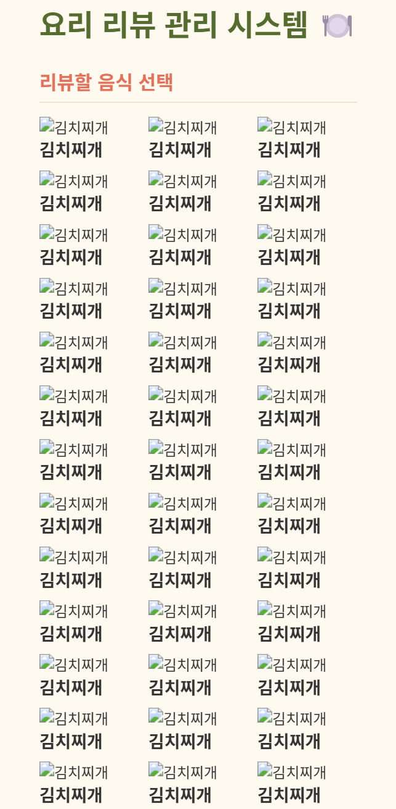

```markdown
# ✅ SnapNCook 사용자 테스트 결과 기록 (3차)

> **테스트 일자**: 2025-05-12
> **테스트 환경**: dev 서버 (localhost:8000) + 실제 프론트 연결  
> **테스트 담당자**: 민지원 (백엔드)

---

## ✅ 결과 코드 표기 안내

| 코드 | 의미 |
|------|------|
| ✅ | 성공 (정상 동작) |
| ⚠️ | 경고 (동작은 되지만 개선 필요) |
| ❌ | 실패 (기능 오류 또는 예외 처리 안 됨) |
| 🚫 | 테스트 불가 (선행 실패, 프론트 미구현, 접근 불가 등으로 테스트 시도 불가) |
---

## 🔍 3차 테스트 요약표 (선별 항목)

| 시나리오 번호 | 테스트 항목                           | 결과   | 비고 |
|---------------|--------------------------------------|--------|--------|
| U-1           | 프로필 이미지 로딩 실패 시 텍스트 중첩 | ⚠️     | 이미지가 없을 때 사용자 이름이 이미지 영역 안에 깜빡이며 중첩 표시됨 |
| 1-1           | 회원가입 - 성공 및 필수 입력 확인      | ✅     | 비밀번호 확인 포함 전체 가입 흐름 정상 처리 |
| 1-2           | 회원가입 실패 - 이메일 중복            | ⚠️     | 백엔드는 명확한 메시지를 주지만 프론트는 고정 오류 문구만 출력함 |
| 1-3           | 회원가입 실패 - 비밀번호 조건 미달      | ⚠️     | 다중 메시지를 배열로 받지만 프론트는 고정 메시지만 출력함 |
| 1-8           | 비밀번호 변경 성공                    |  ❌    | 조건을 모두 충족했음에도 프론트에서 잘못된 유효성 검사로 요청 자체가 백엔드에 전달되지 않음 |
| 1-9           | 비밀번호 변경 실패 - 현재 비밀번호 오류 |  ❌    | 틀린 현재 비밀번호 입력 시 조건 오류 문구 잘못 노출됨 |
| 1-10          | 비밀번호 변경 실패 - 원인별 메시지     |  ⚠️    | 일부 케이스는 메시지가 정상 출력되었으나, 현재 비밀번호 오류/같은 비밀번호 입력 시에도 조건 미달 문구가 고정으로 노출됨. 조건 미달일 때 동일 메시지가 중복 표시되기도 함 |
| 1-14          | 소셜 로그인 (Google/Kakao/Naver)       |  ❌    | 302 응답은 정상이나 프론트 리디렉션 처리 실패로 오류 메시지 표시됨 |
| 2-2           | 프로필 수정                            |  ✅    | 닉네임 및 프로필 이미지 변경 정상 동작 확인 |
| 4-2           | 내 탐지 결과 조회                     |  ❌    | 데이터가 없거나 필터 조건에 걸려 404 발생, 마이페이지 일부 데이터 표시 실패 | |
| 4-4           | 탐지 기반 추천 (공개)                 |  🚫    | 프론트에서 호출 흐름이 없어 테스트 시도 불가 (미구현 또는 미사용 상태) - public버전이 존재함에도도 필수로 로그인 요구 |
| 5-1           | 재료 입력 저장                         |  ❌    | `input_text` 누락 또는 빈 값으로 인해 422 오류 발생, 저장 실패 |
| 6-3           | 음식별 리뷰 조회                     |  ⚠️    | 요청이 무한 반복 발생, API는 200 응답이나 UI 클릭 불가 + 데이터 미표시 + 이미지 오류 발생 |
| 6-6           | 마이페이지 요약 조회                  |   ❌    | 탐지 결과 없을 때 404 발생 → 전체 오류로 처리됨 |

> ⚠️ 구현 미완료인 부분에 대해서는 테스트 불가로 진행하지 못하였습니다. 해당 부분들은 추후 테스트 예정입니다. 

---

## 🔄 상세 시나리오 결과

### 🔹 U-1. 프로필 이미지 로딩 실패 시 사용자 이름이 이미지 안에 중첩되어 깜빡이며 노출됨

- **상황**: 프로필 이미지를 등록하지 않았거나, 이미지가 로딩되지 못했을 때
- **화면 위치**:  
  - 내 정보 수정 페이지 (`/users/me`)
  - 상단 네비게이션 바 (`Navbar`)
  - 이 외에도 마이페이지 상단, 네비게이션 우측 사용자 메뉴 등 **여러 곳에서 발생**

- **현상**:
  - 이미지가 없는 상태에서 사용자 닉네임 텍스트(`testuser1`)가 이미지 원형 프레임 안에 들어가서 보임
  - 이미지 영역 안에 텍스트가 깜빡이며 겹쳐 보이거나, 깨진 아이콘과 함께 표시됨
  - 일부 경우 텍스트가 이미지 위에 겹치기도 함

- **캡처 예시**:  
  

- **결과**: ⚠️

- **문제 원인 분석**:
  - `ProfileImage`는 이미지 로딩 실패 시 `default-profile.png`를 보여주도록 처리되어 있음 ✅
  - 그러나 `<ProfileImage />` 외부에서 `username` 텍스트를 별도로 렌더링하고 있어서 **두 요소가 겹침**
  - 특히 fallback 이미지가 로딩 지연되면 텍스트만 잠시 노출되어 깜빡이는 현상 발생

- **개선 제안**:
  - **프론트**:
    - `username` 텍스트는 이미지 내부가 아닌 별도 위치에서만 표시되도록 레이아웃 수정
    - fallback 처리는 `ProfileImage` 내부에서 조건부로 텍스트 렌더링하거나, 외부에서 중복되지 않도록 분기
    - 이미지가 없을 경우만 원형 박스 안에 `닉네임 첫 글자` 등을 표시하는 방식도 가능

---

### 🔹 1-1. 회원가입 - 성공 및 필수 입력 확인

- **성공 케이스**
  - 입력: 이메일, 닉네임, 비밀번호, 비밀번호 확인 → 조건 만족
  - 결과: ✅ 정상 가입 처리 및 토큰 발급

- **입력 유효성 케이스**
  - 비밀번호와 비밀번호 확인을 일치시킨 경우
  - `"비밀번호 확인이 일치하지 않습니다."` 같은 메시지는 백엔드에서 제대로 반환되고, 프론트에서도 분기 처리되어 잘 표시됨

- **결론**: 전체 플로우 정상 처리됨

---

### 🔹 1-2. 회원가입 실패 - 이메일 중복

- **입력**: 이미 등록된 이메일 `testuser2@test.com`으로 가입 시도
- **응답**: `400 Bad Request`, 백엔드에서는 `"이미 등록된 이메일입니다"` 메시지를 반환
- **화면 표시**: 🔴 `"회원가입 중 오류가 발생했습니다."` (구체적인 메시지 없음)
- **캡처 화면**:  
  

- **문제 분석**
  - 프론트에서는 `error.response.data.detail` 값을 렌더링하지 않고 고정 메시지만 출력 중
  - 사용자 입장에서는 오류 원인을 파악할 수 없음

- **결과**: ⚠️ 메시지 분기 부족

- **개선 제안**
  - 프론트에서 `error.response.data.detail`을 그대로 출력하거나 `"이미 등록된 이메일입니다"`로 분기 필요

---

### 🔹 1-3. 회원가입 실패 - 비밀번호 조건 미달

- **입력**: 비밀번호에 숫자/특수문자 없음 (`testuser`)
- **응답**: `422 Unprocessable Content`, 백엔드는 아래와 같은 배열 형태 메시지를 반환
    ```json
    [
      { "msg": "비밀번호에는 최소 1개의 숫자가 포함되어야 합니다." },
      { "msg": "비밀번호에는 최소 1개의 특수문자(@$!%*#?&)가 포함되어야 합니다." }
    ]
    ```
- **화면 표시**: 🔴 `"회원가입 중 오류가 발생했습니다."` (조건별 메시지가 보여지지 않음)
- **로그 확인**: `POST /api/auth/signup` 요청은 백엔드에 정상 도달했고 422 응답 발생

- **문제 분석**
  - 프론트는 배열을 처리하지 않고 고정된 일반 에러 문구만 렌더링 중
  - 사용자 입장에서는 어떤 조건이 미달되었는지 알기 어려움

- **결과**: ⚠️ 프론트에서 에러 메시지를 분기 출력하지 않아 UX에 문제 있음

- **개선 제안**
  - 프론트:
    - `error.response.data.detail`이 문자열이면 그대로, 배열이면 `.map(e => e.msg).join("\n")` 등의 방식으로 출력
    - 이메일 중복, 비밀번호 조건, 누락 필드 등 케이스별 분기 처리 필요

---

### 🔹 1-8. 비밀번호 변경 성공 (실패)

- **입력 내용**  
  - 현재 비밀번호: `testuser1!`  
  - 새 비밀번호: `newtestuser1!`  
  - 새 비밀번호 확인: `newtestuser1!`  
  → 모든 조건을 만족함

- **예상 동작**  
  - `PATCH /users/me/password` 호출  
  - 상태 코드 200  
  - 메시지: "비밀번호가 성공적으로 변경되었습니다."

- **실제 결과**  
  - 화면에는 "비밀번호는 최소 8자 이상, 문자와 숫자를 포함해야 합니다."라는 에러 메시지가 표시됨
  - 백엔드 로그에는 `PATCH /users/me/password` 요청이 **전혀 기록되지 않음**
  - 대신 홈화면 관련 API만 호출됨 (`/api/home/recommended-food`, `/api/home/popular-searches` 등)

- **캡처 화면**  
  

- **문제 분석**  
  - 프론트엔드에서 새 비밀번호가 조건을 만족했음에도 유효성 검사에 실패했다고 잘못 판단함
  - 서버로의 요청이 차단되어 백엔드는 실행되지 않음
  - 잘못된 고정 에러 메시지를 출력함

- **결과**: ❌

- **개선 제안**  
  - 프론트:
    - 유효성 검사 정확히 재검토
    - 백엔드로 요청이 정상적으로 전달되도록 수정
    - 백엔드 응답에 따라 메시지를 동적으로 출력해야 함

---

### 🔹 1-9. 비밀번호 변경 실패 - 현재 비밀번호 오류

- **요청**: `PATCH /users/me/password`
```json
{
  "current_password": "testuser1!!",  // 틀린 비밀번호
  "new_password": "newtestuser1!",
  "new_password_check": "newtestuser1!"
}
```

- **응답 상태 코드**: ❌ 없음 (백엔드 요청 미도달)
- **프론트 메시지**:  
  🔴 `"비밀번호는 최소 8자 이상, 문자와 숫자를 포함해야 합니다."`

- **실제 상태**:
  - 새 비밀번호는 조건을 모두 만족했지만,
  - 현재 비밀번호가 **틀렸음에도 불구하고** `"비밀번호 조건 오류"` 메시지가 표시됨
  - 요청이 **백엔드로 넘어가지 않음** (`PATCH /users/me/password` 호출 없음)

- **캡처 화면**:  
  

- **문제 원인**:
  - 프론트에서 current_password가 틀린 경우에도 이를 백엔드에 전달하지 않고
  - 고정된 메시지 (`비밀번호 조건 오류`)를 미리 출력해버림
  - 백엔드의 `"현재 비밀번호가 틀렸습니다"`와 같은 메시지를 받을 기회조차 없음

- **결과**: ❌

- **개선 제안**:
  - **프론트**:  
    - 입력값이 조건을 만족할 경우 **반드시 서버로 요청 전송** 후 응답 메시지 기반으로 분기 처리 필요
    - `"현재 비밀번호가 틀렸습니다"` 등의 메시지를 백엔드 응답에 따라 정확히 출력하도록 개선
  - **백엔드**:  
    - 이미 메시지 분기 로직이 있는지 확인하고, 명확한 오류 메시지 (`400`, `"현재 비밀번호가 틀렸습니다"`)를 반환 중인지 재확인

---

### 🔹 1-10-②. 비밀번호 변경 실패 - 새 비밀번호 조건 미달

- **요청**: `PATCH /users/me/password`
```json
{
  "current_password": "testuser1!",
  "new_password": "newtestuser1",  // 숫자는 있으나 특수문자 없음
  "new_password_check": "newtestuser1"
}
```

- **응답 상태 코드**: 400 Bad Request

- **프론트 메시지**:  
  🔴 `"비밀번호는 8자 이상이며, 숫자와 특수문자(@$!%*#?&)를 포함해야 합니다."`  
  (※ 동일한 문구가 **두 번** 반복되어 표시됨)

- **캡처 화면**:  
  

- **결과**: ⚠️

- **문제 원인 분석**:
  - 백엔드에서 password 조건 미달에 대해 여러 오류 메시지를 리스트 형태로 전달
  - 프론트에서 각 메시지를 중복 렌더링하거나 동일 메시지를 두 번 렌더링하는 로직 오류 가능성

- **개선 제안**:
  - **프론트**:
    - 동일 메시지 중복 제거 (`Set` 처리 등)
    - 메시지 렌더링 시 중복 체크 후 표시
  - **백엔드**:
    - 메시지가 중복 포함되는 구조라면 하나로 합치거나 명확한 구분 필요

---

### 🔹 1-10-④. 비밀번호 변경 실패 – 새 비밀번호가 기존 비밀번호와 동일

- **요청**: `PATCH /users/me/password`
```json
{
  "current_password": "testuser1!",
  "new_password": "testuser1!",
  "new_password_check": "testuser1!"
}
```

- **응답 상태 코드**: 없음 (백엔드 요청 미도달)

- **프론트 메시지**:  
  🔴 `"비밀번호는 최소 8자 이상, 문자와 숫자를 포함해야 합니다."`

- **실제 상태**:
  - 새 비밀번호와 현재 비밀번호가 동일함
  - 백엔드에는 요청이 **전달되지 않았고**, `"비밀번호 조건"`에 대한 **고정된 오류 메시지**가 표시됨
  - 서버 로그에서도 `PATCH /users/me/password` 호출 없음

- **캡처 화면**:  
  

- **문제 원인 분석**:
  - 백엔드에는 `"새 비밀번호는 이전 비밀번호와 달라야 합니다."` 라는 분기 처리가 이미 구현되어 있음
  - 하지만 프론트에서 사전 조건 검사를 잘못 처리하거나 모든 실패를 `"비밀번호 조건"` 메시지로 통일해버림
  - 이로 인해 사용자는 **실제 실패 원인을 알 수 없음**

- **결과**: ❌

- **개선 제안**:
  - **프론트**:
    - `new_password === current_password` 조건 분기 처리 필요
    - 해당 조건 시 `"기존 비밀번호와 다른 비밀번호를 입력해주세요"` 등 정확한 피드백 제공
  - **백엔드**:
    - 현재 로직은 이미 분기 처리됨 (`400` + `"새 비밀번호는 이전 비밀번호와 달라야 합니다."`)

---

### 🔹 1-14. 소셜 로그인 실패 - 프론트 리디렉션 처리 오류

- **요청**: `GET /api/oauth/google|kakao|naver/login`
- **백엔드 응답**: 302 Found (Google, Kakao, Naver 모두 정상 리디렉션)
- **화면 표시**:  
  🔴 `"Naver 로그인 시작 중 오류가 발생했습니다."`  
  (Google, Kakao도 동일 화면면)

- **캡처 화면**:  
  

- **문제 분석**
  - 백엔드는 정상적으로 리디렉션 응답을 반환하고 있음
  - 프론트에서 소셜 로그인 요청을 fetch/axios 등의 비동기 방식으로 처리하면서 302를 오류로 인식함
  - `window.location.href = ...` 방식이 아닌 경우, redirect가 막히고 catch 블록에서 오류 메시지를 띄우는 구조로 추정

- **결과**: ❌ 리디렉션 시작에서 클라이언트 측 처리 오류 발생

- **개선 제안**
  - 프론트:
    - 소셜 로그인 요청은 반드시 `window.location.href` 또는 `<a href=...>` 방식으로 동기 리디렉션 처리
    - 비동기 요청을 사용하는 경우 redirect 응답을 적절히 처리하도록 개선
  - 백엔드:
    - 리디렉션 응답은 현재 정상 처리 중 → 변경 없음

---

### 🔹 4-2. 내 탐지 결과 조회 실패 - 404 오류

- **요청**: `GET /detection-results/me`
- **응답 상태**: `404 Not Found`
- **로그 확인**:
  ```
  INFO:     127.0.0.1:12842 - "GET /api/detection-results/me HTTP/1.1" 404 Not Found
  ```
- **화면 표시**:  
  🔴 마이페이지 내 "탐지 결과 불러오기 실패" 오류 메시지가 표시됨  
  탐지 결과 관련 정보가 비어 있는 상태로 렌더링됨

- **문제 분석**
  - 프론트에서 마이페이지 진입 시 탐지 결과 목록을 조회하기 위해 호출
  - 백엔드 라우터는 정상 작동 중이며 요청은 전달됨
  - 해당 유저의 탐지 결과가 없거나, user_id 기반 필터 조건으로 인해 데이터가 조회되지 않아 404 발생
  - 이로 인해 마이페이지 전체 렌더링 흐름이 끊김

- **결과**: ❌ 탐지 결과 조회 실패로 마이페이지 데이터 일부 로드 불가

- **개선 제안**
  - 프론트:
    - 404 응답 시 "데이터 없음"으로 처리하고, 오류 메시지 대신 빈 리스트 안내 문구 출력
    - 전체 마이페이지 렌더링이 중단되지 않도록 예외 분기 필요
  - 백엔드:
    - 존재하지 않는 경우 404 대신 빈 배열(200 OK)로 반환하는 방식도 고려 가능

---

### 🔹 5-1. 재료 입력 저장 실패 - 422 오류 발생

- **입력**: 재료 입력창에 `"감자"` 입력 후 저장 시도
- **요청**: `POST /user-ingredient-inputs`
  - 예상 전송 body: `{ "input_text": "감자" }`

- **응답 상태**: `422 Unprocessable Content`

- **화면 표시**:  
  🔴 `"재료 입력 저장 실패"`라는 알림이 상단에 표시됨  
  동시에 "검색 결과 없음" 화면이 뜸
  

- **로그 확인**
  ```
  INFO:     127.0.0.1:13389 - "POST /api/user-ingredient-inputs/ HTTP/1.1" 422 Unprocessable Content
  ```

- **문제 분석**
  - 백엔드에서는 `input_text`를 필수로 요구하고 있음 (`str` 타입, 필수)
  - 프론트에서 해당 필드가 누락되었거나 빈 문자열로 전송된 것으로 추정됨
  - 유효성 검사에서 걸려 백엔드 로직 진입 전 422 반환됨

- **결과**: ❌ 재료 입력 저장 실패 (요청 본문 유효성 문제)

- **개선 제안**
  - 프론트:
    - `input_text`가 빈 값일 경우 요청 차단
    - 사용자에게 입력값 누락 메시지를 명확히 전달
  - 백엔드:
    - 스키마 구조는 문제 없음. 유효성 검증 정확하게 작동 중

---

### 🔹 6-3. 음식별 리뷰 조회 - 무한 요청 및 클릭 비활성화

- **요청**: `GET /reviews/food/{food_id}` (예: 6, 7번 음식 ID)
- **응답 상태**: `200 OK`
- **로그 확인**:
    GET /api/reviews/food/6 HTTP/1.1 → 수십 회 반복  
    GET /api/reviews/food/7 HTTP/1.1 → 수십 회 반복

- **UI 현상**:
  - 리뷰할 음식 목록에 동일한 음식(예: 김치찌개)이 반복 출력되나, 이는 테스트 데이터 구조에 따른 현상으로 오류는 아님
  - 모든 이미지가 깨져 보임 (`` 경로 오류 또는 이미지 필드 누락 가능성)
  - 음식 항목을 클릭해도 **화면 전환이나 상세 보기 진입이 없음**
  - 마우스 커서도 일반 텍스트 선택 커서로 유지되어, 클릭 가능한 요소로 인식되지 않음
  
  

- **문제 분석**:
  - 프론트엔드에서 `useEffect` 또는 상태 변경 로직 문제로 인해 **API 요청이 무한 반복**
  - 음식 항목 클릭 이벤트가 정상 작동하지 않으며, UI 상 상호작용이 불가능한 상태
  - 실제 리뷰 데이터는 DB에 없어서 화면상 표시되는 리뷰 내용도 없음
  - 이미지 경로 오류로 `` 요소들이 모두 실패 상태로 표시됨

- **결과**: ⚠️ API는 정상 응답하나, UI 반복 요청 + 클릭 무응답 + 이미지 미표시로 UX 상 기능 미완성 상태

- **개선 제안**:
  - **프론트**:
    - 무한 요청 방지: `useEffect` 의존성 배열 및 호출 조건 재점검
    - 음식 클릭 시 상세 페이지로 이동하는 이벤트 핸들러 추가 및 커서 스타일 수정
    - 이미지 경로 확인 및 fallback 이미지 처리
  - **백엔드**:
    - `GET /reviews/food/{food_id}`는 문제 없음, 정상 응답 반환 중
  - **테스트 데이터**:
    - 리뷰 데이터가 없어서 화면상 출력 없음 → 테스트용 리뷰 더미 데이터 필요

---

### 🔹 6-6. 마이페이지 요약 조회 실패

- **요청**: `GET /mypage/summary` (인증 토큰 포함)
- **응답 상태**: 200 OK
- **내부 호출 로그**:
  - `/bookmarks/me` → 200
  - `/reviews/me` → 200
  - `/detection-results/me` → ❌ 404

- **프론트 화면**:
  

- **문제 원인**:
  - `detection-results/me`가 404일 경우 전체 오류처럼 처리됨
  - 프론트에서 개별 오류를 분리하지 않고 일괄 실패 처리한 것으로 보임

- **결과**: ❌

- **개선 제안**:
  - 백엔드: `/detection-results/me` 404 시 빈 리스트 반환으로 바꾸거나 예외 처리 고려
  - 프론트: 각 데이터 fetch 요청을 분리 처리하고, 일부 실패 시에도 나머지 정상 데이터는 보여주도록 개선 필요

---

## 📝 개선 제안 요약 (3차 기준)

---

### 🖥️ 프론트엔드

- **공통**
  - 서버 응답 메시지를 고정 문구가 아닌 실제 `error.response.data.detail` 기반으로 표시
  - 비어 있는 상태 또는 조건 미달 입력값에 대해 에러 메시지 노출 필요 (`회원가입`, `재료 입력`, `비밀번호 변경` 등)
  - 커서 포인터 설정 누락 → 클릭 가능 요소에도 `pointer` 커서 미적용됨
  - 이미지 깨짐에 대비한 fallback 이미지 설정 필요

- **UI/UX 개선**
  - 리뷰 음식 목록 클릭 시 화면 이동 없음 → 클릭 이벤트 핸들러 추가 필요
  - 음식별 리뷰 조회 시 무한 API 요청 발생 → `useEffect` 의존성 또는 상태 흐름 개선 필요
  - 탐지 기반 추천 결과가 없을 경우 `"결과 없음"` 안내 메시지 노출 필요
  - 소셜 로그인 요청 시 `window.location.href` 방식으로 전환 필요 (axios/fetch는 302를 error로 처리함)

- **테스트 케이스 연동**
  - 입력 필드 유효성 실패 시에는 버튼 비활성화 또는 경고 문구 출력
  - 회원가입 오류 메시지 분기 처리 미흡 (`이메일 중복`, `비밀번호 조건 미달` 등)

### 🛠️ 백엔드

- **유효성 검증 및 응답 처리**
  - 불필요한 `bcrypt.__about__` 접근 에러 로그는 있지만 당장 현재 기능엔 영향 없음

- **기능 보완**
  - `/upload/image` 라우트는 dev 브랜치에 미반영 상태 → 머지 이후 재테스트 필요
  - 리뷰 작성 시 빈 문자열 방지 로직 필요 (프론트에서 제어하거나 백엔드에서 필터링)

---

### 🧪 테스트 환경 관련

- 테스트용 더미 데이터(DB) 부족으로 리뷰, 추천 결과 등 일부 화면은 데이터 없음 상태로만 확인됨
- 리뷰/레시피/탐지 결과 등 실제 사용 시나리오에 맞는 샘플 데이터 구성 필요

---

## 📎 참고

- [1차 테스트 결과 보기](./1st.md)
- [2차 테스트 결과 보기](./2nd.md)
```
