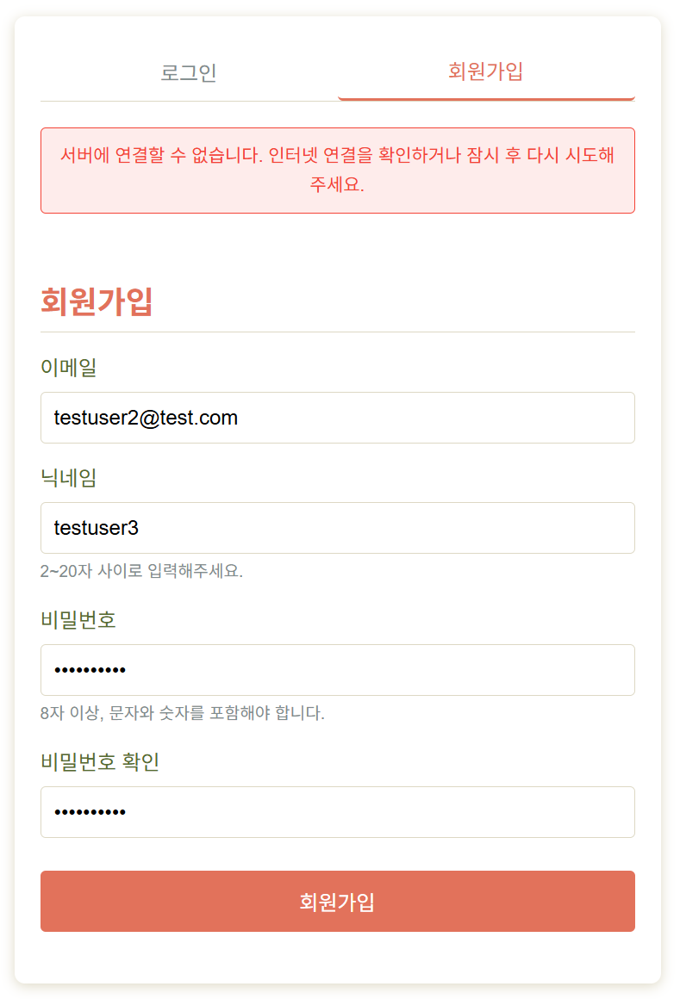
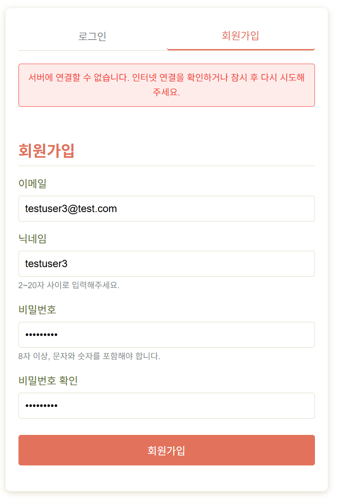
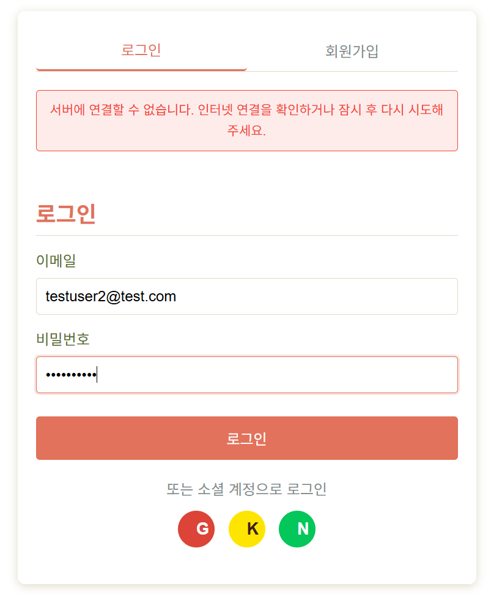
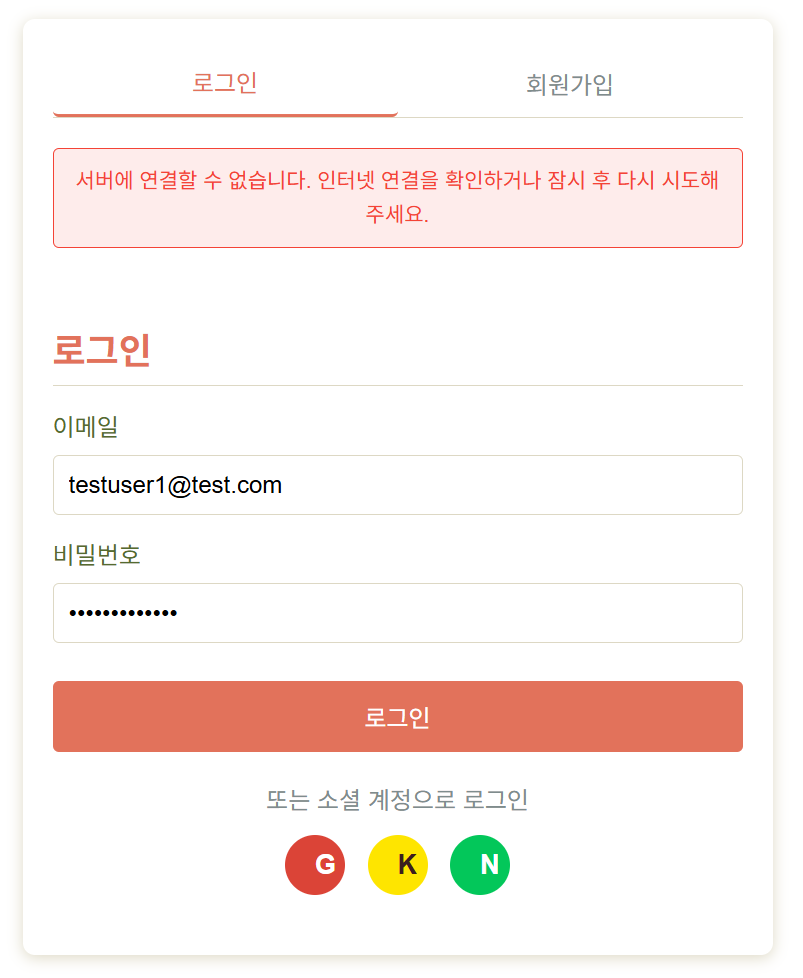
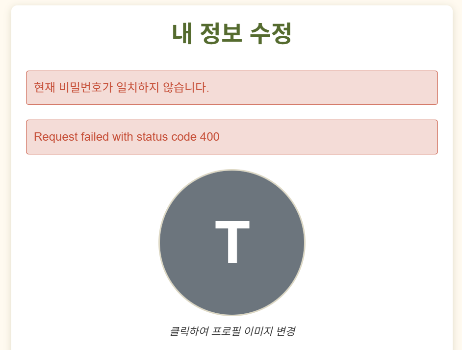
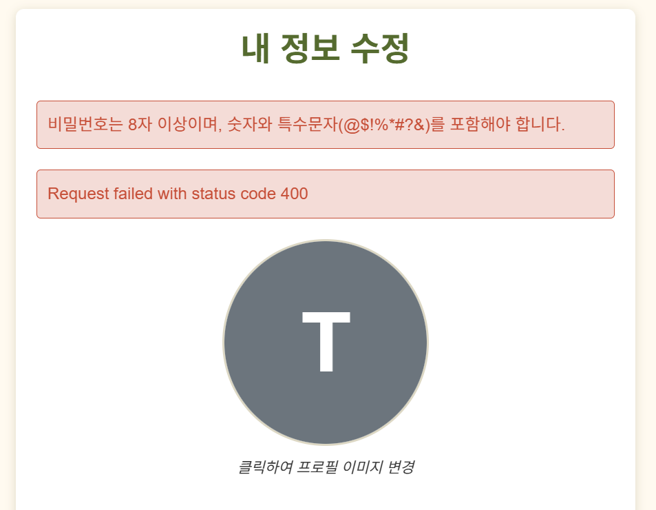
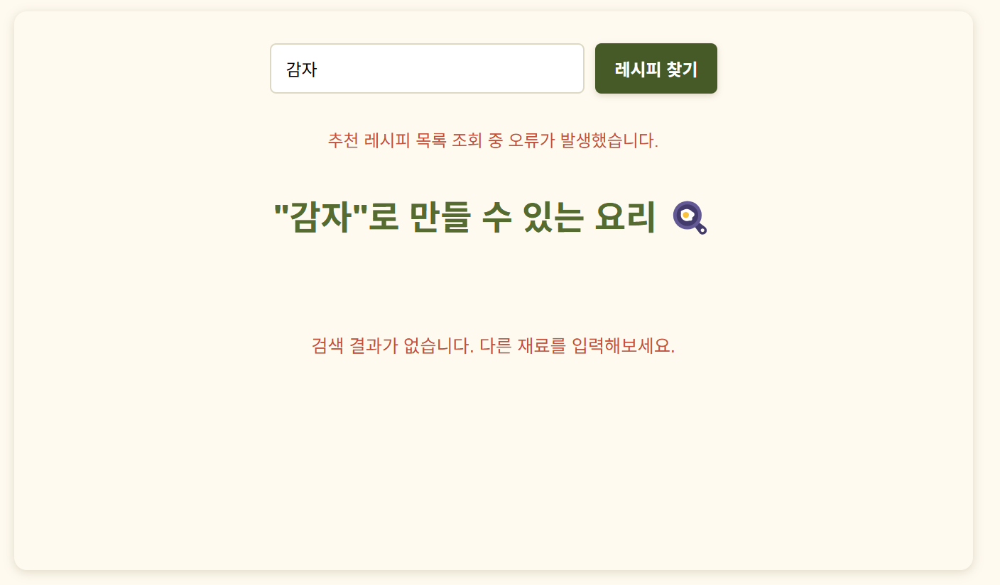

# ✅ SnapNCook 사용자 테스트 결과 기록 (4차)

> **테스트 일자**: 2025-05-16
> **테스트 환경**: dev 서버 (localhost:8000) + 실제 프론트 연결  
> **테스트 담당자**: 민지원 (백엔드)

---

## ✅ 결과 코드 표기 안내

| 코드 | 의미 |
|------|------|
| ✅ | 성공 (정상 동작) |
| ⚠️ | 경고 (동작은 되지만 개선 필요) |
| ❌ | 실패 (기능 오류 또는 예외 처리 안 됨) |
| 🚫 | 테스트 불가 (선행 실패, 프론트 미구현, 접근 불가 등으로 테스트 시도 불가) |

---

## 🔍 4차 테스트 요약표 (선별 항목)

| 시나리오 번호 | 테스트 항목                           | 결과   | 비고 |
|---------------|--------------------------------------|--------|--------|
| U-1           | 프로필 이미지 로딩 실패 시 텍스트 중첩 |   ✅   | 이미지 미등록 시 닉네임 텍스트가 중첩되지 않고 정상적으로 fallback 렌더링됨 |
| 1-2           | 회원가입 실패 - 이메일 중복           |   ⚠️   | 백엔드는 400 응답을 반환하나, 프론트에서 "서버에 연결할 수 없습니다"로 잘못 표시함 |
| 1-3           | 회원가입 실패 - 비밀번호 조건 미달    |   ⚠️   | 백엔드는 422 응답을 반환하나, 프론트에서 "서버에 연결할 수 없습니다"로 표시함 |
| 1-5           | 로그인 실패 - 비밀번호 오류            |   ⚠️   | 백엔드는 401 응답과 "Incorrect password" 메시지를 반환하나, 프론트에서는 "서버에 연결할 수 없습니다"라는 잘못된 에러 메시지를 출력함 |
| 1-6           | 로그인 실패 - 존재하지 않는 이메일     |   ⚠️   | 백엔드는 401 응답과 "Invalid credentials" 메시지를 반환하나, 프론트에서 "서버에 연결할 수 없습니다"로 잘못 표시됨 |
| 1-8           | 비밀번호 변경 성공                    |   ✅   | 백엔드 요청 정상 도달 및 "비밀번호가 성공적으로 변경되었습니다" 메시지 정상 표시됨 |
| 1-9           | 비밀번호 변경 실패 - 현재 비밀번호 오류 |   ⚠️   | 사용자 메시지는 정확히 출력되나, "Request failed with status code 400"이 함께 노출됨 |
| 1-10          | 비밀번호 변경 실패 - 원인별 메시지     |   ⚠️   | 조건 미달 시 메시지는 정확히 출력되나, "Request failed with status code 400"이 함께 노출됨. UX상 중복 메시지로 혼란 유발 |
| 1-14          | 소셜 로그인 (Google/Kakao/Naver)       |   ❌   | 버튼 클릭 시 로그인 요청 자체가 발생하지 않음. OAuth 흐름 미시작. 로그 및 네트워크 기록 없음 |
| 4-2           | 내 탐지 결과 조회                     |   ❌   | 데이터가 없을 경우 404가 반환되어 마이페이지 일부가 전체 실패 처리됨. 빈 배열로 응답하고 UI 분기 필요 |
| 4-4           | 탐지 기반 추천 (공개)                 |   🚫   | 프론트에서 호출 흐름이 없어 테스트 시도 불가 (미구현 또는 미사용 상태) - public버전이 존재함에도도 필수로 로그인 요구 |
| 5-1           | 재료 입력 저장                        |   ✅   | 사용자가 입력한 재료 텍스트가 정상적으로 DB에 저장되고 input_id가 발급됨 |
| 5-2           | 추천 레시피 매핑 저장                 |   🚫   | 레시피 데이터가 없어 추천 매핑을 생성할 수 없음. 테스트 유효성 확보 불가 |
| 5-3           | 추천 목록 조회                        |   ⚠️   | 추천 결과가 없는 경우 404가 반환되어 오류처럼 보임. 빈 배열로 응답하고 안내 메시지 출력이 더 적절함 |
| 6-3           | 음식별 리뷰 조회                     |   ⚠️   | 카드 클릭 가능해졌으나 이미지 비동기 로딩 시 크기 변화로 카드 전체가 튀는 현상 발생 |
| 6-6           | 마이페이지 요약 조회                  |   ⚠️   | 탐지 결과 API가 404를 반환했으나 마이페이지는 전체 렌더링됨. 일부 영역만 fallback 메시지로 대체됨 |

> 🔁 앞선 테스트에서 발견된 문제점 위주로 수정 후 재검증을 중심으로 진행되었습니다.  
> 💡 신규 기능 또는 UI 개선 사항이 포함된 부분은 중점 테스트 대상으로 선택하였습니다.

---

## 🔄 상세 시나리오 결과

### 🔹 1-2. 회원가입 실패 – 이메일 중복

- **입력 예시**:
```json
{
  "email": "testuser2@test.com",  // 이미 등록된 이메일
  "password": "testuser3@",
  "password_check": "testuser3@",
  "nickname": "testuser3"
}
```

- **기대 응답**:
  - `400 Bad Request`
  - 메시지: `"이미 등록된 이메일입니다"`

- **실제 결과**:
  - **FastAPI 로그**:
    ```
    INFO:     127.0.0.1:14730 - "POST /api/auth/signup HTTP/1.1" 400 Bad Request
    ```
  - **프론트 표시 메시지**:  
    🔴 `"서버에 연결할 수 없습니다. 인터넷 연결을 확인하거나 잠시 후 다시 시도해주세요."`

- **캡처 화면**:  
  

- **결과**: ⚠️

- **문제 분석**:
  - 백엔드는 중복 이메일에 대해 명확한 400 에러와 메시지를 반환함
  - 프론트는 이를 제대로 렌더링하지 못하고, fallback 에러 메시지를 그대로 노출함
  - 사용자 입장에서는 이메일 중복인지, 서버 오류인지 구분 불가능

- **개선 제안**:
  - **프론트**:
    - `error.response?.data?.detail` 값을 기반으로 메시지를 출력하도록 수정
    - `"서버에 연결할 수 없습니다"`는 실제 네트워크 오류일 때만 출력되도록 분기 필요

---

### 🔹 1-3. 회원가입 실패 – 비밀번호 조건 미달

- **입력 예시**:
```json
{
  "email": "testuser3@test.com",
  "nickname": "testuser3",
  "password": "testuser3",          // 조건 미달: 특수문자 없음
  "password_check": "testuser3"
}
```

- **기대 응답**:
  - `422 Unprocessable Content`
  - 메시지:  
    ```json
    [
      { "msg": "비밀번호에는 최소 1개의 숫자가 포함되어야 합니다." },
      { "msg": "비밀번호에는 최소 1개의 특수문자(@$!%*#?&)가 포함되어야 합니다." }
    ]
    ```

- **실제 결과**:
  - FastAPI 로그:
    ```
    INFO:     127.0.0.1:1191 - "POST /api/auth/signup HTTP/1.1" 422 Unprocessable Content
    ```
  - 프론트 표시 메시지:  
    🔴 `"서버에 연결할 수 없습니다. 인터넷 연결을 확인하거나 잠시 후 다시 시도해주세요."`

- **캡처 화면**:  
  

- **결과**: ⚠️

- **문제 분석**:
  - 백엔드는 유효성 검증 결과를 `422 + detail[]`로 정상 반환
  - 프론트는 이 메시지를 출력하지 않고, fallback 메시지를 일괄 표시
  - 사용자는 비밀번호 조건이 틀렸는지조차 알 수 없음

- **개선 제안**:
  - **프론트**:
    - `error.response?.data?.detail` 배열을 파싱하여 각 메시지 `.msg`를 추출해 사용자에게 출력해야 함
    - 네트워크 오류일 때만 `"서버에 연결할 수 없습니다"` 메시지를 사용하도록 분기 처리 필요

---

### 🔹 1-5. 로그인 실패 - 잘못된 비밀번호

- **입력 예시**:
```json
{
  "email": "testuser2@test.com",
  "password": "틀린비밀번호"
}
```

- **기대 응답**:  
  `401 Unauthorized`  
  메시지: `"Incorrect password"`

- **실제 반응**:
  - 백엔드 로그:
    ```
    INFO:     127.0.0.1:14279 - "POST /api/auth/login HTTP/1.1" 401 Unauthorized
    ```
  - 프론트 메시지:  
    🔴 `"서버에 연결할 수 없습니다. 인터넷 연결을 확인하거나 잠시 후 다시 시도해주세요."`

- **캡처 화면**:  
  

- **결과**: ⚠️

- **문제 분석**:
  - 백엔드는 예상대로 401 Unauthorized를 반환한 것으로 보임
  - 프론트가 해당 에러를 catch 블록에서 처리하면서, 네트워크 오류 메시지로 덮어씀
  - 사용자 입장에서는 서버 자체가 죽은 것처럼 오해할 수 있음

- **개선 제안**:
  - **프론트**:
    - HTTP 상태 코드 401, 403 등은 명확히 구분해서 사용자 메시지를 출력해야 함
    - `error.response?.status === 401` 등의 조건 분기 처리 필요
---

### 🔹 1-6. 로그인 실패 – 존재하지 않는 이메일

- **입력 예시**:
```json
{
  "email": "testuser1@test.com",  // 존재하지 않는 계정
  "password": "anything123!"
}
```

- **기대 응답**:  
  `401 Unauthorized`  
  메시지: `"Invalid credentials"`

- **실제 결과**:
  - 백엔드 로그:
    ```
    INFO:     127.0.0.1:14296 - "POST /api/auth/login HTTP/1.1" 401 Unauthorized
    ```
  - 프론트 메시지:  
    🔴 `"서버에 연결할 수 없습니다. 인터넷 연결을 확인하거나 잠시 후 다시 시도해주세요."`

- **캡처 화면**:  
  

- **결과**: ⚠️

- **문제 분석**:
  - 백엔드는 정확히 401과 `"Invalid credentials"` 메시지를 반환함
  - 프론트에서 이 에러를 네트워크 실패처럼 처리하여 사용자에게 **엉뚱한 메시지** 출력
  - **기능적으로는 실패 처리 성공이지만, 사용자 UX 기준에서는 부적절한 메시지 노출**

- **개선 제안**:
  - **프론트**:
    - 401 오류에 대한 분기 처리 필요
    - `"Invalid credentials"` 메시지를 그대로 사용자에게 출력하거나 `"등록되지 않은 이메일입니다"` 등의 메시지로 매핑 필요

---

### 🔹 1-9. 비밀번호 변경 실패 - 현재 비밀번호 오류

- **입력**:
```json
{
  "current_password": "testuser2@@",
  "new_password": "newtestuser2@",
  "new_password_check": "newtestuser2@"
}
```

- **응답 상태 코드**: `400 Bad Request`

- **화면 반응**:
  - `"현재 비밀번호가 일치하지 않습니다."` ← ✅ 사용자에게 명확한 메시지 출력됨  
  - `"Request failed with status code 400"` ← ⚠️ 기술적 에러 메시지가 함께 노출되어 사용자 경험 저해

- **캡처 화면**:  
  

- **결과**: ⚠️

- **문제 분석**:
  - 백엔드는 `"현재 비밀번호가 일치하지 않습니다."`라는 메시지를 정상 반환함
  - 프론트는 해당 메시지를 사용자에게 잘 표시했으나,
  - 동시에 Axios 또는 Fetch 에러에서 발생한 기술 메시지(`status code 400`)도 함께 출력되어 혼란을 유발함

- **개선 제안**:
  - **프론트**:
    - `error.response.data.detail` 값만 사용자에게 노출되도록 분기 처리 필요
    - HTTP 상태 코드 또는 기본 에러 메시지는 로그로만 기록하거나 숨김 처리 권장

---

### 🔹 1-10. 비밀번호 변경 실패 - 새 비밀번호 조건 미달

- **입력**:
```json
{
  "current_password": "testuser2@",
  "new_password": "newtestuser2",  // 숫자 있음, 특수문자 없음
  "new_password_check": "newtestuser2"
}
```

- **응답 상태 코드**: `400 Bad Request`

- **화면 반응**:
  - `"비밀번호는 8자 이상이며, 숫자와 특수문자(@$!%*#?&)를 포함해야 합니다."` ← ✅ 사용자 메시지 잘 표시됨  
  - `"Request failed with status code 400"` ← ⚠️ 기술적 메시지가 함께 노출되어 시각적으로 혼란

- **캡처 화면**:  
  

- **결과**: ⚠️

- **문제 분석**:
  - 백엔드는 조건 미달에 대해 명확한 메시지를 잘 반환함
  - 프론트에서 이를 렌더링하면서 기술적 메시지까지 함께 출력하여 UX 저하 발생

- **개선 제안**:
  - **프론트**:
    - `error.response.data.detail` 내용만 출력되도록 분리 렌더링
    - `status code 400` 같은 기술 메시지는 사용자 화면에 표시하지 않도록 숨김 처리

---

### 🔹 1-14. 소셜 로그인 실패 – OAuth 요청 자체가 발생하지 않음

- **테스트 방식**:  
  로그인 페이지에서 Google, Kakao, Naver 각각의 소셜 로그인 버튼을 5회 이상 클릭

- **기대 동작**:
  - 버튼 클릭 시 `/api/oauth/{provider}/login` 라우트로 GET 요청 발생
  - 302 응답으로 OAuth 로그인 창 리디렉션
  - 이후 콜백 → 토큰 저장 → 홈 리디렉션 또는 사용자 정보 표시

- **실제 결과**:
  - 클릭 후 아무런 변화 없이 홈 화면으로 되돌아옴  
  - 화면상 변화는 있지만, OAuth 인증 흐름은 시작되지 않음  
  - **개발자 도구(Network)**에서도 `/api/oauth/...` 관련 요청 없음
  - **FastAPI 로그**:
    ```
    INFO:     127.0.0.1:3487 - "GET /api/home/recommended-food HTTP/1.1" 200 OK
    INFO:     127.0.0.1:3486 - "GET /api/home/popular-searches?period=day HTTP/1.1" 200 OK
    ```
    → 홈으로 이동하여 관련 요청만 있고 소셜 로그인 관련 로그는 전혀 없음

- **캡처 화면**: 없음 (요청 자체가 발생하지 않아 메시지도 표시되지 않음)

- **결과**: ❌

- **문제 분석**:
  - 프론트에서 소셜 로그인 버튼 클릭 시 아무런 API 요청도 발생하지 않음
  - 버튼에 연결된 이벤트 핸들러가 작동하지 않거나, `href` 또는 `window.location.href` 처리 누락/차단 가능성 있음
  - 이전 테스트에서는 302까지는 응답되었으나 이번에는 **로그인 흐름 시작 자체가 안 됨**

- **개선 제안**:
  - **프론트**:
    - 소셜 로그인 버튼에 `window.location.href = "/api/oauth/{provider}/login"`과 같은 명시적 리디렉션 로직 필요
    - 버튼에 `onClick` 이벤트가 정상 연결되었는지 확인
    - `<a href="#">` 등의 기본 클릭 이벤트 방해 요소가 있는지 점검 필요

---

### 🔹 4-2. 내 탐지 결과 조회 – 빈 데이터 시 404 반환 (UI는 유지됨)

- **요청**: `GET /detection-results/me`

- **응답 상태**:  
  `404 Not Found`

- **FastAPI 로그**:
  ```
  INFO:     127.0.0.1:2021 - "GET /api/detection-results/me HTTP/1.1" 404 Not Found
  ```

- **프론트 화면 반응**:
  - 마이페이지 전체 레이아웃은 유지됨
  - 탐지 결과(업로드한 사진) 영역에는 `"업로드한 사진이 없습니다"`라는 안내 문구가 정상 출력됨
  - 다른 항목(즐겨찾기, 리뷰 등)도 마찬가지로 데이터 없음 상태를 잘 표현함

- **결과**: ❌

- **문제 분석**:
  - 서버 응답이 404인 것은 REST API 관점에서는 부적절함  
    → **빈 리스트인 경우엔 200 OK + `[]` 반환이 맞음**
  - 현재 프론트는 해당 404 응답을 **예외 처리하여 fallback 메시지를 보여주고 있음**
  - 다만 API 일관성과 명시성 측면에서 개선 여지 있음

- **개선 제안**:
  - **백엔드**:
    - `return []`으로 수정하여 빈 상태도 200 OK로 응답되도록 처리 권장
  - **프론트**:
    - 현재 fallback 처리 잘 작동 중이나, 응답 코드에 따른 명확한 UI 구분 로직도 유지 필요

---

### 🔹 5-3. 추천 목록 조회 – 결과 없음 (404 반환)

- **요청**: `GET /user-ingredient-input-recipes/input/45`

- **FastAPI 로그**:
```
INFO:     127.0.0.1:2431 - "GET /api/user-ingredient-input-recipes/input/45 HTTP/1.1" 404 Not Found
```

- **프론트 화면 반응**:
  - 상단 경고 메시지: `"추천 레시피 목록 조회 중 오류가 발생했습니다."`
  - 하단 메시지: `"감자"로 만들 수 있는 요리 없음`, `"검색 결과가 없습니다"` 안내 출력

- **결과**: ⚠️

- **문제 분석**:
  - 추천 매핑이 존재하지 않아 서버가 404를 반환
  - 그러나 이 상황은 오류라기보다는 결과 없음 → 200 OK + 빈 배열로 응답하는 것이 더 적절
  - 프론트는 현재 404를 경고 배너로 처리하여 사용자에게 혼란 유발

- **개선 제안**:
  - **백엔드**:
    - 추천 결과가 없을 경우 404 대신 200 OK와 빈 리스트 `[]` 반환
  - **프론트**:
    - 추천 결과 없음에 대한 메시지와 서버 오류 메시지를 분리 처리
    - 현재처럼 404를 경고 메시지로 띄우는 방식 개선 필요

- **캡처 화면**:  
  

---

### 🔹 6-3. 음식별 리뷰 조회 – UI 튐 현상 발생

- **요청**: `GET /reviews/food/{food_id}`

- **응답 상태**: 200 OK  
- **데이터 수신 여부**: ✅ 수신됨

- **기능 개선됨**:
  - 이전에는 카드 클릭이 불가능했으나, 현재는 리뷰 항목이 **카드 형태로 클릭 가능하게 구현됨**
  - 요청 반복 문제도 발생하지 않음

- **현상**:
  - 이미지가 로딩되는 타이밍에 따라 카드 크기가 커졌다 작아졌다 반복됨
  - 이로 인해 카드 전체가 **팔딱팔딱 튀듯이 움직이는 시각적 노이즈** 발생
  - 특히 이미지 영역이 먼저 렌더링되고 나머지 텍스트나 박스가 밀리면서 높이 변화 발생

- **캡처 예시**:  
  _움직임이라 캡처는 어렵지만, 카드가 로딩 중 계속 위아래로 점프함_

- **결과**: ⚠️

- **문제 분석**:
  - `` 태그가 비동기 로딩되며 높이나 너비가 결정되지 않아 **컨테이너 높이가 계속 변함**
  - 이미지가 늦게 뜨거나 깨질 경우, 해당 카드만 순간적으로 늘어났다 줄어듦
  - **리스트 전체 레이아웃이 불안정해짐 → UX 저하**

- **개선 제안**:
  - **프론트**:
    - 이미지 컨테이너의 크기를 고정 (`aspect-ratio`, `min-height`, `max-height`)하거나
    - **로딩 중에도 placeholder 공간 확보**하는 방식 사용 (`skeleton`, `object-fit: cover`)
    - 이미지 로딩 실패 시 fallback 이미지 또는 기본 아이콘 설정 추천
  - **백엔드**:
    - 이미지 URL이 존재하지 않거나 잘못된 경우가 있는지도 확인 (ex. `/null`, `/undefined` 등)

---

### 🔹 6-6. 마이페이지 요약 조회 – 일부 종속 API 실패

- **요청**: `GET /mypage/summary`

- **FastAPI 로그**:
  ```
  INFO:     127.0.0.1:2025 - "GET /api/mypage/summary HTTP/1.1" 200 OK
  INFO:     127.0.0.1:2021 - "GET /api/detection-results/me HTTP/1.1" 404 Not Found
  INFO:     127.0.0.1:2026 - "GET /api/bookmarks/me HTTP/1.1" 200 OK
  ```

- **프론트 화면 반응**:
  - 마이페이지 전체는 정상 렌더링됨
  - 탐지 결과 카드 영역에 `"업로드한 사진이 없습니다"`라는 fallback 안내 메시지 표시됨
  - 북마크, 리뷰 항목도 문제없이 출력됨 (또는 "없습니다"로 안내)

- **결과**: ⚠️

- **문제 분석**:
  - `/mypage/summary` 자체는 200 OK로 정상 응답함
  - 내부에서 호출되는 `/detection-results/me`가 404를 반환하면서,
    해당 데이터가 빠지고 fallback UI로 대체됨
  - 사용자 입장에서는 문제 없어 보이지만, **기술적으로는 일부 종속 API가 실패한 상태**

- **개선 제안**:
  - **백엔드**:
    - `/detection-results/me`에서 404 대신 200 OK + 빈 리스트를 반환하면  
      마이페이지 요약 API도 모든 섹션에서 일관된 데이터 구조 유지 가능
  - **프론트**:
    - 현재처럼 fallback 메시지를 분기 처리하는 구조는 유지
    - 추후 모든 내부 요청을 try/catch로 나누어 부분 실패에도 전체 렌더링 유지 권장

---

## 📝 개선 제안 요약 (4차 기준)

### 🖥️ 프론트엔드

- **에러 메시지 처리 개선**  
  - `error.response?.data?.detail` 값을 기반으로 사용자 메시지를 출력하도록 개선 필요  
  - 현재는 400, 401, 422 등도 `"서버에 연결할 수 없습니다"`로 일괄 처리되어 UX 혼란 유발  
  - `401`, `400` 등의 상태 코드별로 메시지를 분기 렌더링할 것

- **결과 없음 vs 오류 구분**  
  - `404` 응답을 무조건 경고 메시지로 처리하지 말고  
    `"추천 결과 없음"`, `"업로드한 사진이 없습니다"` 등 안내 메시지로 분기 처리 필요

- **소셜 로그인 버튼 이벤트 미작동**  
  - Google/Kakao/Naver 버튼 클릭 시 `/api/oauth/...` 요청 자체가 발생하지 않음  
  - `onClick` 또는 `window.location.href` 방식의 명확한 리디렉션 로직 추가 필요

- **이미지 로딩 안정화**  
  - 음식별 리뷰 카드에서 이미지 로딩 시 레이아웃 점프 현상 발생  
  - `aspect-ratio`, `object-fit: cover`, skeleton placeholder 등을 통해 이미지 로딩 안정화 필요

- **마이페이지 구성 개선**  
  - `/mypage/summary` 내부에서 일부 항목이 실패해도 전체 마이페이지 렌더링은 잘 되고 있음  
  - 각 섹션별 fallback 메시지(`"없습니다"`)는 잘 동작하지만, 향후 실패 사유 로깅 또는 사용자 메시지 개선 여지 있음

---

### 🛠️ 백엔드

- **리스트 조회 시 응답 일관성 보장**  
  - `/detection-results/me`, `/user-ingredient-input-recipes/input/{id}` 등에서  
    추천 결과나 탐지 결과가 없을 경우 **404 대신 200 OK + 빈 배열 `[]` 반환** 권장  
  - REST API 관점에서 “리소스 없음”이 아닌 “결과 없음”은 빈 리스트로 처리하는 것이 표준

- **에러 메시지 구조 유지**  
  - 모든 주요 에러에 대해 `"detail"` 필드로 사용자 친화적인 메시지를 전달하고 있음 → 이 구조는 유지
  - 단, 일부 케이스에서 `"status code 400"` 같은 기술 메시지를 함께 포함하지 않도록 명확히 분리하는 것도 검토 가능

- **소셜 로그인 라우트 정상 작동 확인**  
  - 현재 프론트에서 `/api/oauth/{provider}/login` 요청이 호출되지 않고 있으나  
    백엔드에서 해당 라우트에 문제가 있는지 점검 필요 (redirect URL 구성 등 포함)

---

### 📦 기타

- **테스트 유효성 확보 필요**  
  - 추천 매핑 관련 기능(5-2 등)을 테스트하려면 사전에 레시피 데이터 삽입 필요  
  - 레시피 미보유 상태에서는 추천 로직 테스트가 유효하지 않음

- **테스트 환경 리마인드**  
  - 현재 dev 환경에서는 일부 데이터(DB) 초기화 상태임 → 테스트 시 필요한 더미 데이터 세팅이 반복 필요

---

## 📎 참고

- [1차 테스트 결과 보기](./1st.md)
- [2차 테스트 결과 보기](./2nd.md)
- [3차 테스트 결과 보기](./3rd.md)
