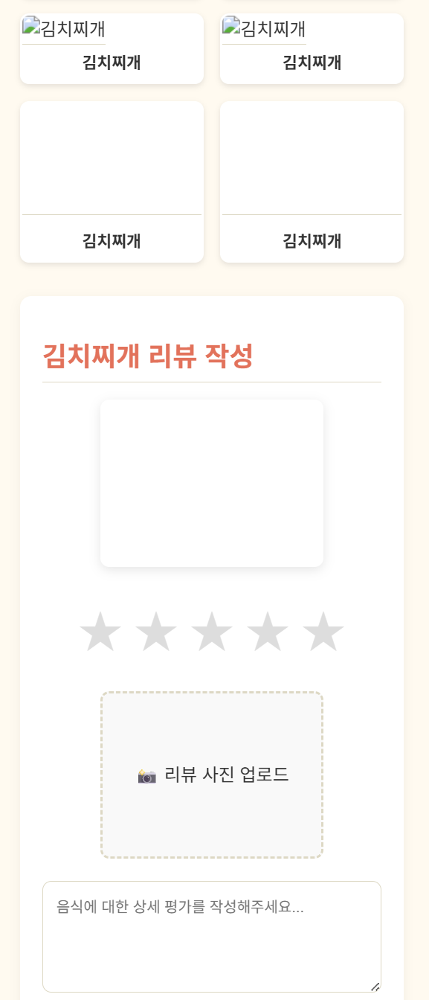

# ✅ SnapNCook 사용자 테스트 결과 기록 (5차)

> **테스트 일자**: 2025-05-19
> **테스트 환경**: dev 서버 (localhost:8000) + 실제 프론트 연결  
> **테스트 담당자**: 민지원 (백엔드)

---

## ✅ 결과 코드 표기 안내

| 코드 | 의미 |
|------|------|
| ✅ | 성공 (정상 동작) |
| ⚠️ | 경고 (동작은 되지만 개선 필요) |
| ❌ | 실패 (기능 오류 또는 예외 처리 안 됨) |
| 🚫 | 테스트 불가 (선행 실패, 프론트 미구현, 접근 불가 등으로 테스트 시도 불가) |

---

## 🔍 5차 테스트 요약표 (선별 항목)

| 시나리오 번호 | 테스트 항목                         | 결과   | 비고 |
|---------------|------------------------------------|--------|------|
| 1-2           | 회원가입 실패 - 이메일 중복         |   ⚠️   | 백엔드는 400 응답을 반환하나, 프론트에서 "서버에 연결할 수 없습니다"로 잘못 표시함 |
| 1-3           | 회원가입 실패 - 비밀번호 조건 미달  |   ⚠️   | 백엔드는 422 응답을 반환하나, 프론트에서 "서버에 연결할 수 없습니다"로 표시함 |
| 1-5           | 로그인 실패 - 비밀번호 오류         |   ⚠️   | 백엔드는 401 응답을 반환하나, 프론트에서 "서버에 연결할 수 없습니다"를 출력함 |
| 1-6           | 로그인 실패 - 존재하지 않는 이메일  |   ⚠️   | 백엔드는 401 응답을 반환하나, 프론트에서 "서버에 연결할 수 없습니다"로 잘못 표시됨 |
| 1-9           | 비밀번호 변경 실패 - 현재 비밀번호 오류 |   ⚠️   | "현재 비밀번호가 일치하지 않습니다" 메시지는 잘 표시되지만 동일 메시지가 상단/하단에 중복 표시됨 |
| 1-10          | 비밀번호 변경 실패 - 원인별 메시지   |   ⚠️   | 조건 미달 시 메시지는 정확히 출력되나, 동일 문구가 상단/하단에 중복 표시됨 |
| 1-14          | 소셜 로그인 (Google/Kakao/Naver)    |   ❌   | 백엔드는 302로 정상 리디렉션 응답하나, 프론트는 리디렉션을 처리하지 못하고 실패 메시지를 표시함 |
| 4-2           | 내 탐지 결과 조회                   |   ✅   | 빈 배열일 경우에도 200 OK로 정상 응답되고, 마이페이지 내에서 fallback 메시지로 적절히 처리됨 |
| 4-4           | 탐지 기반 추천 (공개)               |   🚫   | 프론트에서 호출 흐름이 없어 테스트 시도 불가 (미구현 또는 미사용 상태) - public버전이 존재함에도도 필수로 로그인 요구 |
| 5-2           | 추천 레시피 매핑 저장               |   🚫   | 레시피 데이터가 없어 추천 매핑을 생성할 수 없음. 테스트 유효성 확보 불가 |
| 5-3           | 추천 목록 조회                      |   ⚠️   | 404 문제는 해결되어 200 OK로 응답되나, 프론트에서 안내 문구가 중복 출력됨 |
| 6-3           | 음식별 리뷰 조회                    |   ⚠️   | 카드 클릭 시 이미지 미로딩, UI 크기 튐, 작성창 미노출 및 리뷰 API 반복 호출 현상 발생 |
| 6-6           | 마이페이지 요약 조회                  |   ✅   | 탐지 결과, 리뷰, 북마크가 없을 경우에도 fallback 메시지로 처리되어 전체 마이페이지가 정상 렌더링됨 |

> 🔁 앞선 테스트에서 발견된 문제점 위주로 수정 후 재검증을 중심으로 진행되었습니다. 
> ✅ 테스트 되지 않은 부분은 dev에 기능 추가 필요 + 예시 데이터 삽입 필요

---

## 🔄 상세 시나리오 결과

### 🔹 1-2. 회원가입 실패 – 이메일 중복

- **입력 예시**:
```json
{
  "email": "testuser@test.com",  // 이미 등록된 이메일
  "password": "testuser3@",
  "password_check": "testuser3@",
  "nickname": "testuser3"
}
```

- **기대 응답**:
  - `400 Bad Request`
  - 메시지: `"이미 등록된 이메일입니다"`

- **실제 결과**:
  - **FastAPI 로그**:
    ```
    INFO:     127.0.0.1:13431 - "POST /api/auth/signup HTTP/1.1" 400 Bad Request
    ```
  - **프론트 표시 메시지**:  
    🔴 `"서버에 연결할 수 없습니다. 인터넷 연결을 확인하거나 잠시 후 다시 시도해주세요."`

- **캡처 화면**:  
  

- **결과**: ⚠️

- **문제 분석**:
  - 백엔드는 중복 이메일에 대해 명확한 400 에러와 메시지를 반환함
  - 프론트는 이를 파싱하지 못하고 fallback 에러 메시지(`"서버에 연결할 수 없습니다"`)를 출력함
  - 사용자 입장에서는 이메일이 중복된 것인지, 서버 자체가 죽은 것인지 구분할 수 없음

- **개선 제안**:
  - **프론트**:
    - `error.response?.data?.detail` 값을 기반으로 메시지를 출력하도록 수정
    - `"서버에 연결할 수 없습니다"`는 실제 네트워크 오류일 때만 출력되도록 분기 필요

---

### 🔹 1-3. 회원가입 실패 – 비밀번호 조건 미달

- **입력 예시**:
```json
{
  "email": "testuser3@test.com",
  "nickname": "testuser3",
  "password": "testuser3",         // 숫자는 포함되었으나 특수문자 없음
  "password_check": "testuser3"
}
```

- **기대 응답**:
  - `422 Unprocessable Content`
  - 메시지:
    ```json
    [
      { "msg": "비밀번호에는 최소 1개의 특수문자(@$!%*#?&)가 포함되어야 합니다." }
    ]
    ```

- **실제 결과**:
  - **FastAPI 로그**:
    ```
    INFO:     127.0.0.1:1536 - "POST /api/auth/signup HTTP/1.1" 422 Unprocessable Content
    ```
  - **프론트 표시 메시지**:  
    🔴 `"서버에 연결할 수 없습니다. 인터넷 연결을 확인하거나 잠시 후 다시 시도해주세요."`

- **캡처 화면**:  
  

- **결과**: ⚠️

- **문제 분석**:
  - 백엔드는 유효성 검증 실패에 대해 `422 + detail[]` 형태로 정확한 메시지를 반환함
  - 프론트는 이를 제대로 파싱하지 못하고 fallback 에러 메시지(네트워크 실패)를 출력함
  - 사용자 입장에서는 비밀번호 조건 미달이라는 실제 원인을 전혀 알 수 없음

- **개선 제안**:
  - **프론트**:
    - `error.response?.data?.detail` 배열 파싱하여 `.msg` 리스트를 추출한 뒤 사용자에게 출력해야 함
    - `"서버에 연결할 수 없습니다"`는 실제 네트워크 오류일 때만 출력되도록 분기 필요

---

### 🔹 1-5. 로그인 실패 – 잘못된 비밀번호

- **입력 예시**:
```json
{
  "email": "testuser2@test.com",
  "password": "testuser2@"     // 실제 비밀번호는 newtestuser2@
}
```

- **기대 응답**:
  - `401 Unauthorized`
  - 메시지: `"Incorrect password"`

- **실제 결과**:
  - **FastAPI 로그**:
    ```
    INFO:     127.0.0.1:6264 - "POST /api/auth/login HTTP/1.1" 401 Unauthorized
    ```
  - **프론트 표시 메시지**:  
    🔴 `"서버에 연결할 수 없습니다. 인터넷 연결을 확인하거나 잠시 후 다시 시도해주세요."`

- **캡처 화면**:  
  

- **결과**: ⚠️

- **문제 분석**:
  - 백엔드는 정상적으로 비밀번호 오류에 대해 401 응답과 메시지를 반환함
  - 프론트는 이를 제대로 처리하지 않고 네트워크 오류 메시지를 일괄 출력
  - 사용자 입장에서는 비밀번호가 틀렸는지, 서버가 죽었는지 전혀 알 수 없음

- **개선 제안**:
  - **프론트**:
    - `error.response?.status === 401`인 경우 `"비밀번호가 올바르지 않습니다"` 또는 백엔드 메시지를 출력하도록 분기
    - `"서버에 연결할 수 없습니다"`는 실제 네트워크 오류일 때만 보여야 함

---

### 🔹 1-6. 로그인 실패 – 존재하지 않는 이메일

- **입력 예시**:
```json
{
  "email": "testuser3@test.com",  // 존재하지 않는 계정
  "password": "anything123!"
}
```

- **기대 응답**:
  - `401 Unauthorized`
  - 메시지: `"Invalid credentials"`

- **실제 결과**:
  - **FastAPI 로그**:
    ```
    INFO:     127.0.0.1:6613 - "POST /api/auth/login HTTP/1.1" 401 Unauthorized
    ```
  - **프론트 표시 메시지**:  
    🔴 `"서버에 연결할 수 없습니다. 인터넷 연결을 확인하거나 잠시 후 다시 시도해주세요."`

- **캡처 화면**:  
  

- **결과**: ⚠️

- **문제 분석**:
  - 백엔드는 존재하지 않는 이메일에 대해 정확한 401 에러와 메시지를 반환함
  - 프론트는 이를 네트워크 오류처럼 오해하여 `"서버에 연결할 수 없습니다"`라는 잘못된 메시지를 출력
  - 사용자 입장에서는 이메일이 틀린 건지 서버가 죽은 건지 알 수 없음

- **개선 제안**:
  - **프론트**:
    - `error.response?.status === 401`일 때 `"등록되지 않은 이메일입니다"` 혹은 `"아이디 또는 비밀번호가 올바르지 않습니다"` 같은 UX 메시지로 변환 필요
    - `"서버에 연결할 수 없습니다"`는 진짜 네트워크 오류일 때만 출력되도록 분기 처리

---

### 🔹 1-9. 비밀번호 변경 실패 – 현재 비밀번호 오류

- **입력 예시**:
```json
{
  "current_password": "wrongpassword",  // 실제 비밀번호가 아님
  "new_password": "newtestuser2@",
  "new_password_check": "newtestuser2@"
}
```

- **기대 응답**:
  - `400 Bad Request`
  - 메시지: `"현재 비밀번호가 일치하지 않습니다."`

- **실제 결과**:
  - **FastAPI 로그**:
    ```
    INFO:     ... - "PATCH /api/users/me/password HTTP/1.1" 400 Bad Request
    ```
  - **프론트 표시 메시지**:  
    🔴 `"현재 비밀번호가 일치하지 않습니다."`  
    → 메시지는 **상단과 입력 박스 하단에 중복 표시됨**

- **캡처 화면**:  
  

- **결과**: ⚠️

- **문제 분석**:
  - 백엔드는 정상적으로 `"현재 비밀번호가 일치하지 않습니다"`라는 메시지를 반환함
  - 프론트는 이 메시지를 **두 위치(상단 알림 + 하단 인풋 오류)**에 중복 표시하여 시각적으로 과하게 보임
  - 기능 동작에는 문제가 없지만, 사용자 경험 측면에서 메시지 구조가 정리될 필요가 있음

- **개선 제안**:
  - **프론트**:
    - 같은 메시지가 중복 렌더링되지 않도록 공통 알림/필드별 메시지 위치 분리
    - 상단 알림 또는 인풋 에러 중 **하나만** 선택적으로 표시하는 방식 권장 -> 개인적으론 하단에 표시하는 것이 낫다고 생각합니다(사견)

---

### 🔹 1-10. 비밀번호 변경 실패 – 새 비밀번호 조건 미달

- **입력 예시**:
```json
{
  "current_password": "testuser2@",
  "new_password": "newtestuser2",     // 특수문자 없음
  "new_password_check": "newtestuser2"
}
```

- **기대 응답**:
  - `400 Bad Request`
  - 메시지: `"비밀번호는 8자 이상이며, 숫자와 특수문자(@$!%*#?&)를 포함해야 합니다."`

- **실제 결과**:
  - **FastAPI 로그**:
    ```
    INFO:     ... - "PATCH /api/users/me/password HTTP/1.1" 400 Bad Request
    ```
  - **프론트 표시 메시지**:  
    🔴 `"비밀번호는 8자 이상이며, 숫자와 특수문자(@$!%*#?&)를 포함해야 합니다."`  
    → 상단 에러 박스와 인풋 하단 **두 위치에 동일 문구가 중복 출력됨**

- **캡처 화면**:  
  

- **결과**: ⚠️

- **문제 분석**:
  - 백엔드는 새 비밀번호의 조건을 만족하지 못한 경우 정확한 에러 메시지를 반환함
  - 프론트는 해당 메시지를 두 위치(상단/하단)에 동시에 렌더링하고 있음
  - 사용자는 시각적으로 반복되는 오류 메시지로 인해 불필요한 혼란을 겪을 수 있음

- **개선 제안**:
  - **프론트**:
    - 같은 메시지가 중복으로 나타나지 않도록 위치 구분 및 상태 관리 개선 필요
    - 한 곳(상단 or 필드 하단)만 선택적으로 표시하거나, 메시지 구분 방식을 명확히 할 것 -> 개인적으론 하단에 표시하는 것이 낫다고 생각합니다(사견)

---

### 🔹 1-14. 소셜 로그인 실패 – 프론트 리디렉션 처리 실패 (Google / Kakao / Naver)

- **테스트 방식**:
  - 로그인 페이지에서 각각의 소셜 로그인 버튼 클릭 (G, K, N 순서)

- **기대 동작**:
  - 버튼 클릭 시 `/api/oauth/{provider}/login` 라우트로 GET 요청 발생
  - 302 응답으로 OAuth 로그인 창으로 리디렉션
  - 이후 콜백 → 토큰 저장 → 홈 리디렉션 또는 사용자 정보 표시

- **실제 결과**:
  - FastAPI 로그:
    ```
    INFO:     127.0.0.1:8224 - "GET /api/oauth/google/login HTTP/1.1" 302 Found
    INFO:     127.0.0.1:8225 - "GET /api/oauth/kakao/login HTTP/1.1" 302 Found
    INFO:     127.0.0.1:8299 - "GET /api/oauth/naver/login HTTP/1.1" 302 Found
    ```
  - 프론트 화면:
    - 각 플랫폼별로 `"Google/Kakao/Naver 로그인을 시작할 수 없습니다"`라는 메시지만 표시됨
    - 로그인 창으로 리디렉션되지 않음
    - 실제 리디렉션 흐름이 **프론트에서 차단되거나 처리되지 않음**

- **캡처 화면**:  
    
    
  

- **결과**: ❌

- **문제 분석**:
  - 백엔드는 각 `/login` 요청에 대해 정상적으로 302 Found 응답을 반환하고 있음
  - 프론트는 이 요청을 axios/fetch 등 비동기 방식으로 처리하고 있어 **리디렉션을 수동으로 따라가지 않음**
  - 결과적으로 로그인 창이 열리지 않고 catch 블록에서 실패 메시지를 표시함

- **개선 제안**:
  - **프론트**:
    - 소셜 로그인 요청은 반드시 `window.location.href = "/api/oauth/{provider}/login"` 같은 **브라우저 리디렉션 방식**으로 처리할 것
    - axios/fetch를 사용하는 경우, `redirect: "follow"` 설정이나 `302` 응답을 직접 해석하는 로직이 필요하지만, 이 방식은 권장되지 않음
    - `<a href="/api/oauth/google/login">` 등으로 처리하면 가장 명확함
  - **백엔드**:
    - 현재 302 리디렉션 응답은 정상 처리되고 있음 → 변경 필요 없음

---

### 🔹 5-3. 추천 목록 조회 – 안내 문구 중복 출력

- **요청 흐름**:
  ```http
  POST /api/user-ingredient-inputs/
  GET  /api/user-ingredient-input-recipes/input/{input_id}
  ```

- **FastAPI 로그**:
  ```plaintext
  INFO:     ... "POST /api/user-ingredient-inputs/" 200 OK
  INFO:     ... "GET /api/user-ingredient-input-recipes/input/56" 200 OK
  ```

- **화면 출력 결과**:
  - `"감자"로 만들 수 있는 요리` 아래 안내 문구가 동일하게 두 번 반복 출력됨
  - **멘트 내용**:
    ```
    입력하신 재료로 추천할 수 있는 레시피가 없습니다. 다른 재료를 입력해보세요.
    입력하신 재료로 추천할 수 있는 레시피가 없습니다. 다른 재료를 입력해보세요.
    ```

- **캡처 화면**:  
  

- **결과**: ⚠️

- **문제 분석**:
  - 백엔드는 정상적으로 빈 배열에 대해 200 OK 반환
  - 프론트는 fallback 메시지를 **두 곳에서 각각 출력**하고 있어, 결과적으로 **중복 표시**됨
    - 예: 상단 헤더와 하단 안내가 동일 조건에서 중복 렌더링됨

- **개선 제안**:
  - **프론트**:
    - 중복 렌더링 구조 개선 필요 → 메시지를 한 곳에서만 표시하도록 조건 분기 정리
    - 예: `추천 결과.length === 0` 조건을 상위 컴포넌트에서만 처리
    - 디자인적 목적의 텍스트는 보조 텍스트로 분리해 표현하는 것도 고려

---

### 🔹 6-3. 음식별 리뷰 조회 – 이미지 깨짐 + 리뷰 API 무한 호출

- **요청**:
  ```http
  GET /api/reviews/food/{food_id}
  ```

- **응답 상태**:  
  `200 OK` (정상적으로 응답은 함)

- **기능 동작**:
  - 음식 카드는 렌더링되며, 클릭 시 테두리는 빨간색으로 표시됨
  - 그러나 클릭 이후 리뷰 작성창이 뜨지 않음 / 아무 동작 없음
  - 이미지가 모두 깨져 있음 (``로 보이는 현상)
  - 콘솔 및 서버 로그 상 **`GET /api/reviews/food/{id}` 요청이 수십 차례 반복 호출됨**
  - 리뷰 작성 버튼은 `"등록하기"` ↔ `"처리중..."` 상태를 무한 반복 중

- **캡처 예시**:
    
  

- **FastAPI 로그**:
  ```plaintext
  INFO:     127.0.0.1:10054 - "GET /api/reviews/food/2 HTTP/1.1" 200 OK
  (중략) 동일 요청이 수십 회 반복
  ```

- **결과**: ⚠️

- **문제 분석**:
  - 이미지 미등록 → `` 태그에 `undefined` 경로 전달 → 브라우저에서 깨진 이미지 처리
  - 리뷰 작성 창은 특정 상태가 되지 않으면 렌더링되지 않음 (조건부 렌더링 문제)
  - 리뷰 조회 API가 상태 변화나 useEffect 의존성 미처리 등으로 인해 **무한 루프 호출**
  - 작성 중 처리 상태 전환도 무한히 반복되어 **"처리중" 상태에서 멈추지 않음**

- **개선 제안**:
  - **프론트**:
    - 음식 카드 선택 시 `selectedFood`만 바꾸고, 리뷰 작성 영역은 항상 렌더링되게 설정
    - `useEffect`나 `useQuery` 호출 시 음식 ID에만 의존하도록 정확한 의존

---

## 📝 개선 제안 요약 (5차 기준)

### 🖥️ 프론트엔드

- **오류 메시지 처리 개선**
  - 백엔드에서 400/401/422 등의 응답을 받을 경우, `"서버에 연결할 수 없습니다"`로 일괄 처리하지 않도록 수정 필요
  - `error.response?.data?.detail` 또는 `status` 값 기준으로 상황별 맞춤 메시지 출력
  - 네트워크 오류(`!error.response`)일 때만 fallback 문구를 사용

- **오류 메시지 중복 렌더링 방지**
  - 동일한 에러 메시지가 상단 알림 + 인풋 하단에 중복으로 나타나 UX 혼란 유발
  - 하나의 위치(예: 인풋 하단)로 통일하는 방향 권장

- **소셜 로그인 리디렉션 방식 변경**
  - 소셜 로그인 요청을 axios/fetch 등 비동기 요청으로 처리하고 있어 302 응답을 따라가지 못함
  - 반드시 `window.location.href` 또는 `<a href="...">` 등 브라우저 리디렉션 방식으로 변경 필요

- **안내 문구 렌더링 중복 제거**
  - 추천 레시피 없음, 리뷰 없음 등 메시지가 상단/하단에 중복으로 출력되는 문제 존재
  - 조건 분기를 단일 위치로 통합하거나 메시지 역할 분리 필요

- **리뷰 작성 인터페이스 개선**
  - 음식 카드 클릭 후 작성창이 뜨지 않거나, 등록 버튼이 `"처리중..."` 상태에서 멈춤
  - 작성창은 음식 선택과 무관하게 항상 렌더링되도록 수정
  - 버튼 상태 반복은 debounce 또는 상태 플래그로 제어

- **무한 API 호출 루프 해결**
  - `/api/reviews/food/{id}`가 useEffect 또는 상태 변화로 인해 반복 호출됨
  - 의존성 배열과 상태 업데이트 조건 분기 재검토 필요

- **이미지 깨짐 대응**
  - `` 형태로 렌더링되며 UI 깨짐 발생
  - `onError` 핸들러로 fallback 이미지 처리 + `aspect-ratio` 설정 권장

---

### 🛠️ 백엔드

- **API 응답 형식 일관화**
  - 빈 결과일 경우 404가 아닌 200 OK + 빈 배열로 반환되도록 전체적으로 통일함 → 이 상태 유지

- **유효성 검사 오류 메시지 명확화**
  - 비밀번호 조건 등 유효성 실패 시 메시지가 적절하게 detail 배열로 내려오는지 점검 지속

- **image_url 누락 방지**
  - 음식 데이터에 `image_url` 값이 없는 경우가 많아 ``로 이어짐
  - 음식 등록 시 default 이미지 자동 할당 또는 null 값 방지 처리 필요

---

## 📦 기타

- **테스트 유효성 확보**
  - 추천 레시피, 탐지 결과, 리뷰 등 테스트 항목 검증을 위해 dev 환경에 샘플 데이터 사전 등록 필요
  - 특정 조건 하에서만 발생하는 분기 로직 확인 위해 예시 데이터 구성 전략 필요

- **프론트 이벤트 트리거 점검**
  - 클릭, submit 등의 이벤트가 UI에 기대한 상태 변화를 유도하지 않는 경우 발생
  - 버튼/카드 등 컴포넌트의 내부 상태 흐름 확인 및 렌더링 조건 정비 필요

- **서버 API 로그 반복 호출 여부 확인**
  - 리뷰 API 등 일부 endpoint가 수십 번 반복 호출되고 있음
  - 원인 추적 및 프론트 요청 제한 또는 백엔드 캐시/쿼리 보호 장치 필요

---

## 📎 참고

- [1차 테스트 결과 보기](./1st.md)
- [2차 테스트 결과 보기](./2nd.md)
- [3차 테스트 결과 보기](./3rd.md)
- [4차 테스트 결과 보기](./4th.md)
