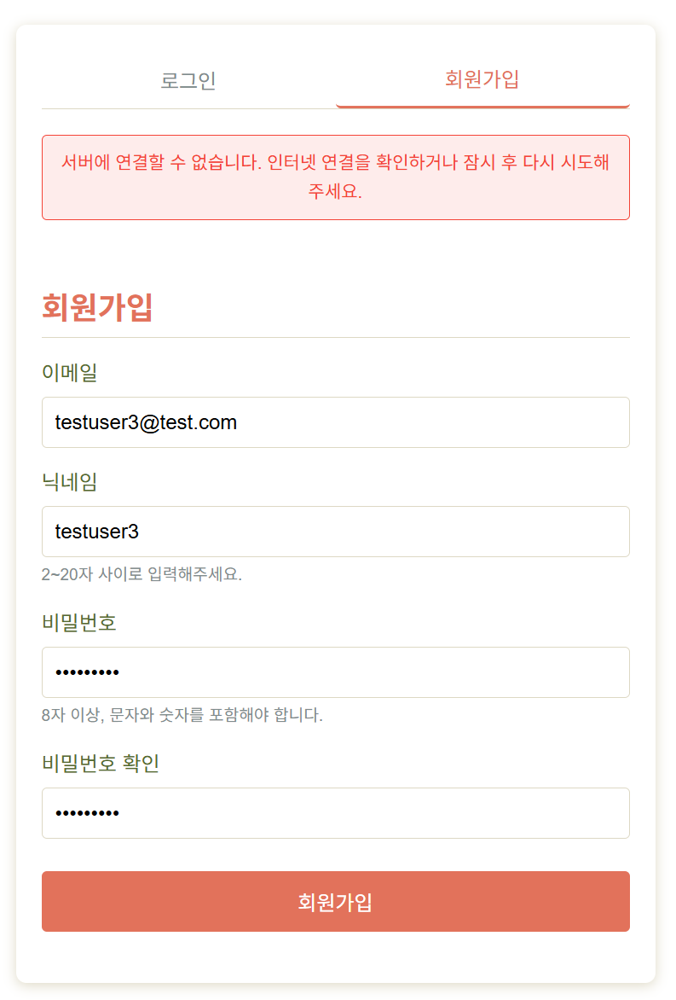
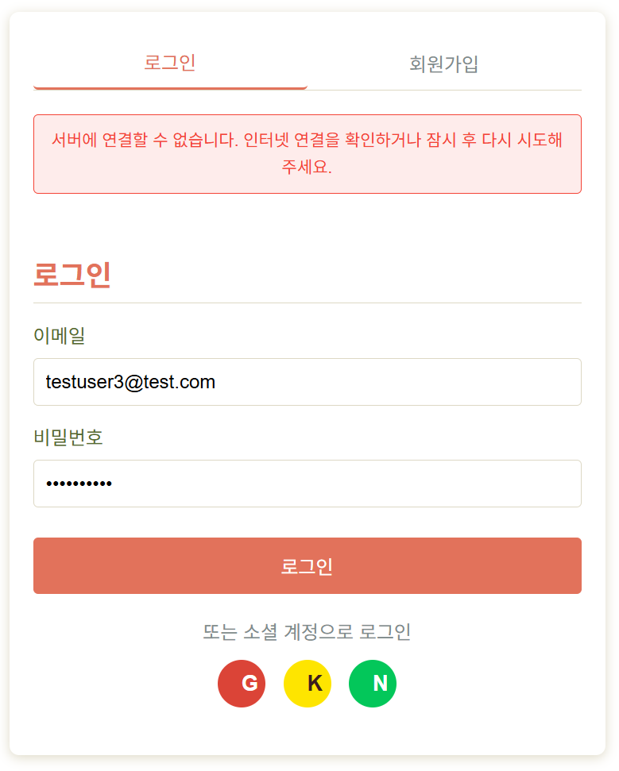

# ✅ SnapNCook 사용자 테스트 결과 기록 (5차)

> **테스트 일자**: 2025-06-03
> **테스트 환경**: dev 서버 (localhost:8000) + 실제 프론트 연결  
> **테스트 담당자**: 민지원 (백엔드)

---

## ✅ 결과 코드 표기 안내

| 코드 | 의미 |
|------|------|
| ✅ | 성공 (정상 동작) |
| ⚠️ | 경고 (동작은 되지만 개선 필요) |
| ❌ | 실패 (기능 오류 또는 예외 처리 안 됨) |
| 🚫 | 테스트 불가 (선행 실패, 프론트 미구현, 접근 불가 등으로 테스트 시도 불가) |

---

## 🔍 5차 테스트 요약표 (선별 항목)

| 시나리오 번호 | 테스트 항목                         | 결과   | 비고 |
|---------------|------------------------------------|--------|------|
| 1-2           | 회원가입 실패 - 이메일 중복         |   ✅   | 프론트에서 정상 출력 |
| 1-3           | 회원가입 실패 - 비밀번호 조건 미달  |   ⚠️   | 백엔드는 422 응답을 반환하나, 프론트에서 "value error, ~"로 표시함 |
| 1-5           | 로그인 실패 - 비밀번호 오류         |   ✅   | 백엔드는 401 응답을 반환하나, 프론트에서 "비밀번호가 올바르지 않습니다"를 출력 |
| 1-6           | 로그인 실패 - 존재하지 않는 이메일   |   ⚠️   | 백엔드는 401 응답을 반환하고 프론트에서 "이메일 또는 비밀번호가 올바르지 않습니다."로 출력 |
| 1-9           | 비밀번호 변경 실패 - 현재 비밀번호 오류 |   ✅   | "현재 비밀번호가 일치하지 않습니다" 메시지 정상 표시시 |
| 1-10          | 비밀번호 변경 실패 - 원인별 메시지   |   ✅   | 조건 미달 시 메시지는 정확히 출력 |
| 1-14          | 소셜 로그인 (Google/Kakao/Naver)    |   ❌   | 로그인 요청은 302 응답으로 리디렉션되나, 콜백 URL 미등록으로 404 발생 |
| 5-2           | 추천 레시피 매핑 저장               |   ❌   | 재료 입력은 성공했으나, 매칭된 음식이 없어 추천 매핑 생성되지 않음 (matched_food_ids 없음) |
| 5-3           | 추천 목록 조회                      |   🚫   | 추천 매핑이 생성되지 않아 결과 확인 불가 (5-2 실패에 기인) |
| 6-3           | 음식별 리뷰 조회                    |   ❌   | 프론트에서 리뷰 조회 요청이 무한 반복되어 로그가 지속 발생함 |

> 🔁 앞선 테스트에서 발견된 문제점 위주로 수정 후 재검증을 중심으로 진행되었습니다. 
> ✅ 테스트 되지 않은 부분은 dev에 기능 추가 필요 + 예시 데이터 삽입 필요

---

## 🔄 상세 시나리오 결과

### 🔹 1-3. 회원가입 실패 – 비밀번호 조건 미달

- **입력 예시**:

```json
{
  "email": "testuser5@test.com",
  "nickname": "testuser5",
  "password": "testuser5",      // 조건 미달: 특수문자 없음 (숫자/문자만 포함)
  "password_check": "testuser5"
}
```

- **백엔드 응답**:
  - `422 Unprocessable Content`
  - 메시지 예시:

```json
[
  { "msg": "비밀번호에는 최소 1개의 특수문자(@$!%*#?&)가 포함되어야 합니다." }
]
```

- **프론트 화면 표시**:
  - 최상단 붉은 경고 박스로 다음과 같은 문구가 출력됨:

    > `Value error, 비밀번호에는 최소 1개의 특수문자(@$!%*#?&)가 포함되어야 합니다.`

  - 비밀번호 입력창 하단에는 여전히 "8자 이상, 문자와 숫자를 포함해야 합니다."라는 고정 안내문만 존재
  - 해당 메시지는 **백엔드에서 반환한 다국적 에러 메시지를 그대로 렌더링하는 구조로 보임**
  - 다만 `"Value error,"`와 같은 **기술적 전처리 문구가 그대로 노출되는 UX 문제가 있음**

- **캡처 이미지 참고**:  
  

- **결과**:
    - 결과 코드: ⚠️
    - 기능은 정상 동작하나, 사용자에게 보여지는 메시지의 표현 방식에 문제 있음

- **문제 분석**:
    - 백엔드는 조건별 메시지를 명확하게 배열로 반환하고 있음
    - 프론트는 해당 배열을 받아 하나의 문자열로 처리해 상단에 렌더링함
    -  `"Value error,"`와 같은 내부 오류 타입명이 사용자에게 그대로 노출됨
    - 필드 하단에는 오류 메시지가 출력되지 않아 시각적으로 분산되고 맥락이 떨어짐

- **개선 제안**:
    - **프론트엔드**:
        - `"Value error,"` 등 내부 에러 타입은 **제거하거나 사용자 메시지와 분리**해야 함
        - 가능하면 필드 하단 또는 해당 input 위치에 메시지를 표시하고, 상단 알림은 요약용으로만 사용하도록 구조 개선
        - 다중 메시지 배열이 있을 경우 `.map(e => e.msg).join("\n")` 방식으로 분기 출력

---

### 🔹 1-6. 로그인 실패 – 존재하지 않는 이메일

- **입력 예시**:

```json
{
  "email": "testuser6@test.com",  // 이메일은 등록되지 않은 값이며, 비밀번호는 형식상 유효함
  "password": "something123!"
}
```

- **백엔드 응답**:
  - `401 Unauthorized`
  - 메시지 예시:
    ```json
    {
      "detail": "Invalid credentials"
    }
    ```

- **프론트 화면 표시**:
  - 현재는 아래와 같은 메시지가 출력됨:
  
    > `"이메일 또는 비밀번호가 올바르지 않습니다."`

  - 그러나 이 경우 실제 문제는 “존재하지 않는 이메일”이며,  
    위와 같은 모호한 메시지는 **사용자에게 혼란을 유발함**
  
  - 더 적절한 메시지:
  
    > `"존재하지 않는 이메일입니다."`

- **캡처 이미지 참고**:  
  

- **문제 분석**:
    - 백엔드는 정확하게 `"Invalid credentials"` 메시지를 반환하고 있음
    - 프론트는 `401` 응답을 받았을 때 통합 문구 `"이메일 또는 비밀번호가 올바르지 않습니다."`로 처리함
    - 사용자 입장에서는 **이메일이 잘못된 건지, 비밀번호가 틀린 건지 구분 불가능**
    - 존재하지 않는 이메일에 대한 명확한 안내가 없는 점은 **UX 저하 요인**

- **결과**:
    - 결과 코드: ⚠️
    - 동작은 성공했으나, 사용자 메시지 분기가 미흡함

- **개선 제안**:
    - **프론트엔드**:
        - `error.response.status === 401`일 때 응답 메시지를 분석하여 아래처럼 분기 처리:
        ```js
            if (error.response?.data?.detail === "Invalid credentials") {
                showMessage("존재하지 않는 이메일입니다.");
            } else if (error.response?.data?.detail === "Incorrect password") {
                showMessage("비밀번호가 올바르지 않습니다.");
            } else {
                showMessage("로그인 중 오류가 발생했습니다.");
            }
        ```
        - 또는 서버 측에서 이메일/비밀번호 오류를 분리해서 내려주면 더욱 명확하게 처리 가능

    - **백엔드**:
        - 보안 정책상 `401` 메시지를 통합해야 하는 상황이 아니라면,  
        `"Invalid credentials"` → `"존재하지 않는 이메일입니다"` 또는 `"비밀번호가 올바르지 않습니다"`로 구체적으로 반환하도록 수정

---

### 🔹 1-14. 소셜 로그인 실패 – Google OAuth 콜백 미등록

- **테스트 흐름**:
    1. 로그인 페이지에서 `G` 버튼 클릭
    2. `/api/oauth/google/login` 요청 정상 발생 → Google 로그인 페이지로 리디렉션  
    3. Google 계정 선택 후 callback 요청 → `GET /oauth/google/callback?...`  
    4. FastAPI 서버에서 404 Not Found 응답 반환

- **FastAPI 로그**:
    ```
    INFO:     127.0.0.1:5230 - "GET /api/oauth/google/login HTTP/1.1" 302 Found
    INFO:     127.0.0.1:5336 - "GET /oauth/google/callback?... HTTP/1.1" 404 Not Found
    INFO:     127.0.0.1:5336 - "GET /favicon.ico HTTP/1.1" 404 Not Found
    ```

- **화면 반응**:
    - Google 인증 완료 후, 리디렉션되자마자 **404 오류 화면 표시**
    - 응답 본문 내용:
        ```json
        { "detail": "Not Found" }
        ```

- **문제 분석**:
    - Google OAuth 인증 자체는 정상적으로 시작됨 (`302 Found`)
    - 인증 완료 후 리디렉션될 콜백 URL `/oauth/google/callback`이 FastAPI에 **존재하지 않음**
    - FastAPI에 해당 경로가 등록되어 있지 않으면 404 발생
    - Google Developer Console에 설정한 `redirect_uri`와 서버 라우트가 일치하지 않음

- **결과**:
    - 결과 코드: ❌
    - 인증 흐름 자체가 **콜백에서 중단되어 로그인 불가**

- **개선 제안**:
    - **프론트엔드**:
        - 로그인 버튼 클릭 시 `window.location.href = "/oauth/google/login"` 형식으로 브라우저 리디렉션 필요
        - 절대 axios나 fetch 등 비동기 요청으로 처리하지 말 것 (302 응답 못 따라감)

    - **백엔드**:
        - `/oauth/google/callback`을 처리할 수 있는 라우트를 반드시 정의해야 함
        ```python
            @router.get("/callback")
            async def google_callback(...):
            ...
        ```
        - `oauth_routes.py`에는 다음처럼 포함돼 있어야 정상 작동함:
        ```python
            router.include_router(google.router, prefix="/oauth/google", tags=["Google OAuth"])
        ```
        - 전체 URL 경로는 `/oauth/google/callback`으로 만들어야 함

    - **Google Developer Console**
        - OAuth 2.0 클라이언트 설정의 redirect URI 항목에 **정확한 콜백 주소** 등록 필요
        예시:
        ```
            http://localhost:8000/oauth/google/callback
        ```
        > `http://localhost:8000/api/oauth/google/callback`처럼 프론트와 백엔드 라우팅이 다르면 반드시 경로 일치시켜야 함

---

### 🔹 5-2. 추천 레시피 매핑 저장 – 레시피는 존재하나 매핑 실패

- **입력 재료**: 감자
- **예상 흐름**:
    1. 사용자가 "감자" 입력
    2. `/user-ingredient-inputs/` → input 저장
    3. `/user-ingredient-input-recipes/input/{id}` → 추천 레시피 조회
    4. 결과 있음 → 추천 레시피 매핑 저장

- **실제 결과**:
    - 레시피는 DB에 존재 (감자 관련 음식 등록 확인됨)
    - 하지만 추천 결과가 생성되지 않음
    - 프론트에서는 다음과 같은 메시지 출력됨:
    > 입력하신 재료로 추천할 수 있는 레시피가 없습니다. 다른 재료를 입력해보세요.

- **캡처 이미지 참고**:  
  

- **문제 분석**:
    - 사용자가 입력한 `"감자"`는 정상 저장됨 (`input_text`)
    - 하지만 `matched_food_ids`에 어떤 음식도 매핑되지 않았기 때문에, 추천 후보 레시피가 전혀 생성되지 않음
    - 원인은 다음 중 하나일 가능성이 높음:
        - `matched_food_ids`를 채워주는 로직에서 `"감자"`와 매칭될 `foods.name` 항목을 찾지 못함
        - 재료 추출 및 매핑 알고리즘에서 `"감자"`를 포함한 문자열이 누락되었거나 전처리 실패
        - 추천 로직에서 food_id 기반 필터링이 제대로 연결되지 않음

- **결과**:
    - 결과 코드: ❌
    - DB에 레시피가 존재함에도 추천 매핑 생성 실패  

- **개선 제안**:
    - **백엔드**:
        - **추천 로직 점검**:
            - `UserIngredientInputCreate` 시점에 `matched_food_ids`가 빈 배열로 저장되는지 확인
            - `"감자"`라는 입력 문자열이 실제 `foods.name` 또는 `recipes.ingredients`에서 감지 가능한지 확인
            - 텍스트 매칭 로직 (`str in ingredients` or 정규식 or 유사도) 개선 필요

        - **데이터 확인**:
            - 음식 DB에 `"감자"` 관련 항목이 존재하는지 재확인 (예: `감자조림`, `감자전` 등)
            - `recipes.ingredients`가 `감자`라는 단어를 포함하고 있는지 여부 검토
            - 테스트용 샘플 데이터를 명시적으로 `감자` 포함하도록 구성하는 것도 방법

---

### 🔹 6-3. 리뷰 조회 – 프론트에서 요청 반복 발생

- **요청 엔드포인트**:
    ```
    GET /api/reviews/food/276
    ```

- **테스트 흐름**:
    1. 음식 상세 페이지 접속 (food_id=276)
    2. 페이지 진입 후 리뷰 목록 요청 시작
    3. 이후 동일 요청이 수십 차례 반복적으로 발생함
    4. 사용자는 별도 조작 없이 대기 중이었음

- **FastAPI 로그** (일부):
```
INFO:     127.0.0.1:6947 - "GET /api/reviews/food/276 HTTP/1.1" 200 OK
INFO:     127.0.0.1:6947 - "GET /api/reviews/food/276 HTTP/1.1" 200 OK
INFO:     127.0.0.1:6947 - "GET /api/reviews/food/276 HTTP/1.1" 200 OK
...
(수십 회 반복)
```

- **문제 분석**:
    - 백엔드는 요청마다 정상적으로 200 OK를 반환 중이며, 에러 없음
    - 프론트에서 동일 `GET` 요청을 **반복적으로 호출하는 구조 문제** 발생
    - `useEffect` 또는 `watch` 함수의 의존성 배열에 `reviews` 자체를 넣거나, 상태 변경이 다시 API 요청을 유발하는 구조일 가능성 높음
    
- **결과**:
    - 결과 코드: ⚠️
    - 데이터는 정상 응답되지만, 불필요한 요청이 서버에 지속적으로 발생 → 부하 우려

- **개선 제안**:
    - **프론트엔드**:
        - `useEffect(() => { fetchReviews(); }, [reviews]);`처럼  
        **`reviews`를 의존성 배열에 포함하지 말 것**
        - 올바른 예시:
        ```tsx
        useEffect(() => {
        fetchReviews();
        }, []); // ✅ mount 시 1회 실행
        ```
        - 또는 리뷰 등록 직후 등 명시적으로만 fetch하도록 구조 개선 필요
        - 요청 반복 시 디버깅을 위해 `console.log("fetchReviews")`를 로그로 확인할 것

    - **백엔드**:
        - 반복 요청이 성능에 영향 줄 경우, 특정 시간 내 동일 IP 요청 제한(Throttle) 고려 가능

---

## 📝 개선 제안 요약 (6차 기준)

### 🖥️ 프론트엔드

- **리뷰 API 무한 호출 루프 수정**
  - `GET /api/reviews/food/{id}` 요청이 상태 변화와 함께 반복적으로 발생
  - `useEffect` 의존성 배열 내 상태 변수 제거 또는 조건 분기 적용 필요
  - debounce 처리나 `mounted` 플래그로 무한 루프 차단 권장

- **소셜 로그인 콜백 URL 누락**
  - Google OAuth 인증 후 `/oauth/google/callback`으로 리디렉션되나 FastAPI에 해당 라우트가 없어 404 발생
  - 백엔드 라우팅 등록 (`/oauth/google/callback`) 및 Google 콘솔의 redirect URI 일치 여부 점검 필요
  - 프론트 측 OAuth 요청은 반드시 `window.location.href` 또는 `<a href="...">` 형식 사용

- **추천 매핑 실패로 결과 없음 표시**
  - "감자" 입력 시 DB에 레시피가 있음에도 추천 결과 없음
  - `matched_food_ids` 생성 실패로 인해 추천 목록이 비어 있음
  - 음식 이름 매칭 로직, ingredients 파싱 정확도 점검 필요

- **사용자 메시지 조건 분기 강화**
  - `"이메일 또는 비밀번호가 올바르지 않습니다."` 문구가 이메일 존재 여부와 무관하게 고정 출력됨
  - 이메일 존재 여부/비밀번호 오류를 분리하여 사용자 피드백 개선 권장

- **리뷰 입력 UI 개선**
  - 작성창이 초기 상태에서 비활성화되거나 클릭 후에도 나타나지 않음
  - 음식 선택 여부와 무관하게 항상 렌더링되도록 조정 필요

- **중복 메시지 렌더링 조정**
  - 안내 메시지 및 오류 경고가 상단과 하단에 동시에 출력되는 구조 있음
  - 역할 분리 또는 위치 통합을 통한 UX 개선 필요

---

### 🛠️ 백엔드

- **OAuth 콜백 라우팅 등록 누락**
  - Google OAuth의 `/oauth/google/callback` 경로를 FastAPI 라우터에 포함해야 함
  - `/api/oauth/google/login`은 리디렉션까지는 잘 작동하나 콜백 경로에서 실패

- **matched_food_ids 생성 로직 검토**
  - 사용자 입력값과 음식 DB간의 문자열 매칭 알고리즘 개선 필요
  - 전처리, 정규화, 유사도 매칭 등 도입 검토

- **불필요한 요청에 대한 로깅 제한**
  - 리뷰 조회 요청이 반복될 경우 DB 부하 및 로그 오염 발생
  - 백엔드 단에서 간단한 rate limit 또는 요청 필터링 로직 도입 고려 가능

---

## 📦 기타

- **테스트 항목 간 연동 실패 케이스 구분**
  - 5-2(추천 매핑 생성 실패)로 인해 5-3(추천 목록 조회)이 의미 없는 테스트가 됨
  - 이전 단계 실패 시 후속 테스트를 생략하거나 관련성 표시 필요

- **샘플 데이터 보강**
  - 리뷰, 음식 이미지, 추천 가능한 음식 등의 샘플 데이터는 dev 환경에 충분히 확보 필요
  - 조건 분기 확인을 위한 테스트 전용 음식/재료/리뷰 데이터 셋 확보 권장

- **프론트 렌더링 조건 점검**
  - 등록/삭제/추천 등 처리 완료 후에도 UI 상태가 변화하지 않음
  - 상태 반영 타이밍과 렌더링 조건 재검토 필요

---

## 📎 참고

- [1차 테스트 결과 보기](./1st.md)
- [2차 테스트 결과 보기](./2nd.md)
- [3차 테스트 결과 보기](./3rd.md)
- [4차 테스트 결과 보기](./4th.md)
- [5차 테스트 결과 보기](./5th.md)
